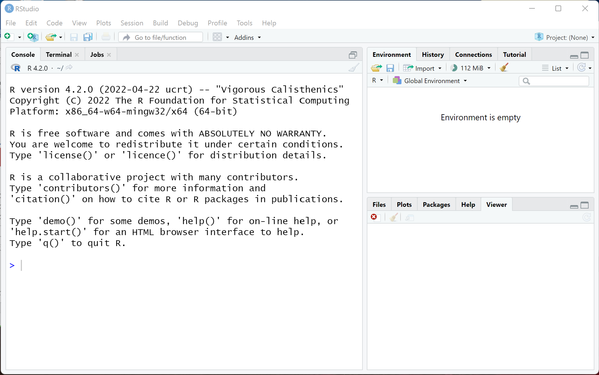

class: title-slide

<br>
<br>
.right-panel[ 

# `r rmarkdown::metadata$title`
## `r rmarkdown::metadata$author`
## `r rmarkdown::metadata$coauthor`
]


---

class: middle center inverse

.font150[hello woRld]


---
class: middle

#  Why R?

```{r echo=FALSE, out.width='100%'}
knitr::include_graphics('img/what-is-r.png')
```

.footnote[Image from Jessica Jaynes, Teaching with R.]

---
## Resources

- Setting Up R on your Computer: https://learnr-examples.shinyapps.io/ex-setup-r/#section-install-r
- Cheat sheets: https://www.rstudio.com/resources/cheatsheets/
- Data Camp Introduction to R: https://www.datacamp.com/courses/free-introduction-to-r
- RStudio Education: https://education.rstudio.com/
- RStudio Education Beginners: https://education.rstudio.com/learn/beginner/
- RStudio Education Data Science Bootcamp for High School Students: https://education.rstudio.com/blog/2020/06/summer-camp-hs/


---

class: middle center inverse

.font150[RStudio]

---
class: middle

# RStudio

RStudio is the most popular coding environment for R.

"The RStudio integrated development environment (IDE) is a set of tools built to help you be more productive with R and Python. It includes a console, syntax-highlighting editor that supports direct code execution. It also features tools for plotting, viewing history, debugging and managing your workspace."


.footnote[(https://posit.co/downloads/)]

---
class: middle

## RStudio

.pull-left[

```{r echo=FALSE, out.width='100%'}

```

]

.pull-right[
- Left window: Console, refer to it as the Command Window. 
We write a command and press enter to run it. 
- Top right window: Environment and History. Here variables and commands are saved.
- Bottom right window: Files, Plot, Packages, Help, and Viewer. Here, files can be opened, plots are displayed, packages can be installed, get help with commands, and view files and slides. 
]

---

class: middle center

<video width="80%" height="45%%" align = "center" controls>
  <source src="screencast/01a-hello-world.mp4" type="video/mp4">
</video>

[RSudio Cheatsheet](https://rstudio.github.io/cheatsheets/html/rstudio-ide.html?_gl=1*1vroy87*_ga*NjQ3MDI2MDYzLjE3MDI1MTI5OTE.*_ga_2C0WZ1JHG0*MTcwMzExNjE3OC4zLjEuMTcwMzExNjQ2NC4wLjAuMA..)

---

class: inverse middle center

.font100[R review]

---

class: middle 

## Arithmetic operations

```{r}
2 + 4

(2 + 4)/40
```


---

class: middle 

## Object assignment operator
In many instances, we need to save a value of a variable or object to use later. In this case, we assign the value to a variable name, and this value will be preserved in the memory of the computer for later referral and use.

```{r}
birth_year <- 1985
```


|                            | Windows        | Mac              |
|----------------------------|----------------|------------------|
| Shortcut     | Alt + -        | Option + -       |


---

class: middle  

## R is case-sensitive


```{r error=TRUE}

my_age <- 2024 - birth_year

My_age
```


---

class: middle 

## Characters
 
Characters are quantities that are not defined in R, so we cannot perform operations with them. They can be assigned to variables. However, characters are always written within quotations. 

```{r}
class <- "Math 220"
class
```

---

class: middle 

## Vectors
 
The second form of assignment is the vector form. We assign a name to an array of numbers or characters. This can be done with the function  `c` which combines values into a vector or list.  

```{r}
age <- c(25, my_age, 32)
age

name <- c("Nicole", "Alma", "Garet")
name
```


---

class: middle

If something comes in quotes, it is not defined in R. 


```{r}

age <- c(25, my_age, 32)

name <- c("Nicole", "Alma", "Garet")

data.frame(age, name)
```

---


## Vocabulary

```{r eval=FALSE}
do(something)
```

`do()` is a function;   
`something` is the argument of the function.
--

```{r eval=FALSE}
do(something, colorful)
```

`do()` is a function;   
`something` is the first argument of the function;   
`colorful` is the second argument of the function.

---

class: middle

## Getting Help

.pull-left[
In order to get any help we can use `?` followed by the function (or object) name. 

```{r eval=FALSE}
?c
```
]


.pull-right[
```{r echo=FALSE, out.width='100%'}
knitr::include_graphics('img/help-window.png')
```
]

---

## tidyverse_style_guide

>canyoureadthissentence?


--
    
.pull-right[

```{r eval = FALSE}
age <- c(6, 9, 15)

data.frame(age_kid = age)
```

]

--

.pull-left[

Before and after operators (e.g. <-, =) leave spaces. 

Put a space after a comma, **not** before. 

After function names do not leave any spaces.

Object names are all lower case, with words separated by an underscore.

]

---
## More about tidyverse style

https://style.tidyverse.org/index.html


