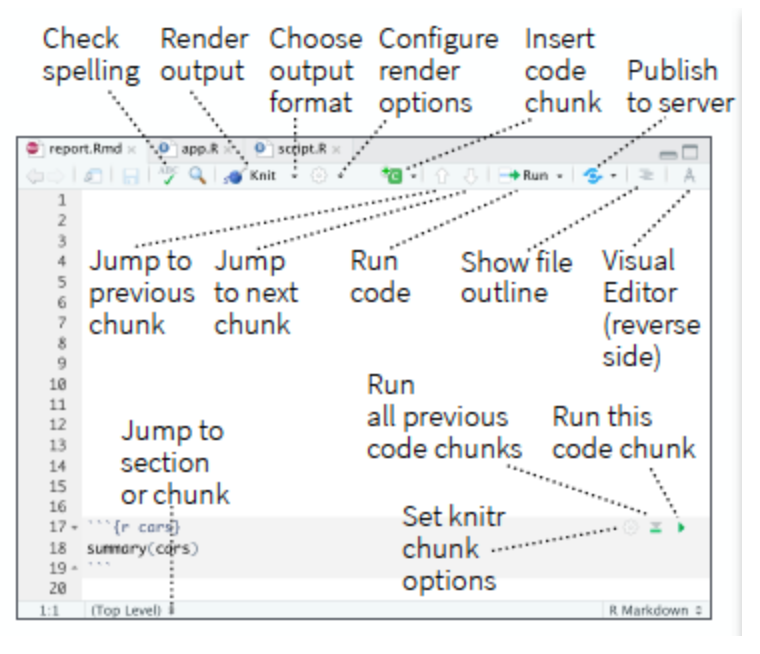
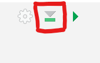

class: title-slide

<br>
<br>
.right-panel[ 

# `r rmarkdown::metadata$title`
## `r rmarkdown::metadata$author`
## `r rmarkdown::metadata$coauthor`
]

---

class: inverse middle center

.font150[R Markdown]

---

# Markdown 

Markdown is a markup language for authoring documents.
It's a simple formatting syntax that describes how text should look on a page.


.pull-left[

```
_Hello world_ 

__Hello world__

~~Hello world~~ 
```
]

.pull-right[

_Hello world_ 

__Hello world__

~~Hello world~~ 
]

<br>
[Markdown Guide](https://www.markdownguide.org/getting-started/)

---

class: middle

# R Markdown

R Markdown is a type of file format designed to produce documents that include both __code and text__.

- Allows you to write your code and context in a single document. You can run code as individual chunks or as an entire document.
- Use multiple languages including R, Python, and SQL.
- Render to a variety of formats including HTML, PDF, MS Word, MS Power Point, Beamer, HTML5 slides, scientific articles, websites, and more.
  - In this class we will be creating HTML files. You are welcome to explore other types of files. 


---

```{r echo=FALSE, out.width='100%'}
knitr::include_graphics('img/icons.png')
```


---

class: center middle

#### R Markdown


<video width="80%" height="45%%" align = "center" controls>
  <source src="screencast/01c-intro-rmarkdown.mp4" type="video/mp4">
</video>

---
class: center middle 

### New R Markdown file
File > New File > R Markdown

```{r echo=FALSE, out.width='40%'}
knitr::include_graphics('img/new-rmarkdown.png')
```


---

### Source Code
```{r echo=FALSE, out.width='100%'}
knitr::include_graphics('img/rmd-parts.png')
```

---

class: center middle

### Source Editor

```{r echo=FALSE, out.width='50%'}

```


---

class: center middle

### Add Chunk

```{r echo=FALSE, out.width='50%'}
knitr::include_graphics('img/code-chunk.png')
```

---

class: center middle

### Run the Current Chunk

```{r echo=FALSE, out.width='20%'}
knitr::include_graphics('img/run-code.png')
```

Sometimes, you will have to run all previous chunks prior to running the current chunk. 

```{r echo=FALSE, out.width='20%'}

```


__Always__ remember to run codes that I provide for you before going over lecture notes and/or doing assignments.
---

class: center middle 

### Knit

```{r echo=FALSE, out.width='50%'}
knitr::include_graphics('img/knit.png')
```

---

class: center middle
.pull-left[__R Code__]

.pull-right[__html file__]

```{r echo=FALSE, out.width='100%'}
knitr::include_graphics('img/rmd-parts-doc.png')
```

---

class: middle center


### Shortcuts

|                            | Windows          | Mac              |
|----------------------------|------------------|------------------|
| add chunk                  | Ctrl + Alt + I   | Cmd + Option + I |
| run the current chunk      | Ctrl + Alt + C   | Cmd + Option + C |
| run current line/selection | Ctrl + Enter     | Cmd + Return     |
| knit                       | Ctrl + Shift + K | Cmd + Shift + K  |


---

class: middle

## My Slides

Slides that you are currently looking at are also written in R Markdown. 

[R Markdown Cheatsheet](https://rstudio.github.io/cheatsheets/html/rmarkdown.html?_gl=1*1lswlbz*_ga*NjQ3MDI2MDYzLjE3MDI1MTI5OTE.*_ga_2C0WZ1JHG0*MTcwMzExNjE3OC4zLjEuMTcwMzExNjQ2NC4wLjAuMA..)

