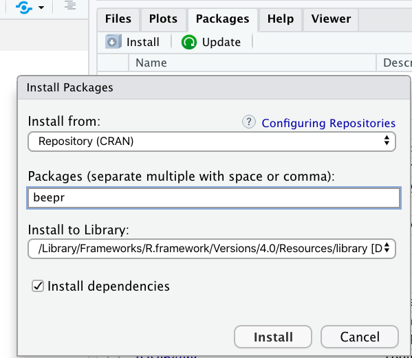

class: title-slide


```{r echo = FALSE, message = FALSE}
library(tidyverse)
options(scipen = 999)
```


<br>
<br>
.right-panel[ 

# `r rmarkdown::metadata$title`
## `r rmarkdown::metadata$author`
## `r rmarkdown::metadata$coauthor`
]


---

class:inverse middle

.font75[R Packages]

---

class: middle center

.pull-left[

__Default__

```{r echo=FALSE, out.width='60%'}

```

]

.footnote[Microsoft products have Copyright. Images used based on [fair use](https://www.microsoft.com/en-us/legal/copyright/default.aspx) for educational purposes.]

.pull-right[

__Optional__

```{r echo=FALSE, out.width='60%'}

```


]

---
class: middle

## R packages


When you download R, you actually download base R. 


But there are MANY optional packages you can download.


---

class: middle


## R packages

There are more than __15000 R packages__. 


__Good part:__ There is an R package for (almost) everything, from complex statistical modeling packages to baby names.


__Bad part:__ At the beginning it can feel overwhelming. 

---

class: middle 

## R packages

All this time we have actually been using R packages. 

---

class: middle 

## R packages

What do R packages have? All sorts of things but mainly

- functions 

- datasets

---

class: middle

## R packages

Try running the following code:

```{r error = TRUE}
beep()
```

Why are we seeing this error? 

--

The function `beep()` does not exist within the default base R packages. We must install the package that contains this function. 

---

class:inverse middle

.font75[Installing packages]

---

## Using `install.packages()`

To install a package we use the function `install.packages("package_name")`. Note that the name of the package is in `" "`. 

The function `beep()` exists in the package named `beepr`. 

In your **Console**, install the beepr package

```{r eval = FALSE}
install.packages("beepr")
```

We do this in the Console because we only need to do it once.

---

## Using Packages pane

```{r echo = FALSE, out.width="40%", fig.align='center'}

```

Packages Pane > Install 

---

## Letting RStudio Install

```{r echo = FALSE, out.width="80%", fig.align='center'}
knitr::include_graphics("img/rstudio-install.png")
```

If you save your file and are using a package, RStudio will tell you that you have not installed the package.

---

class:inverse middle

.font75[Using Packages]

---

## Using beep() from beepr

.pull-left[
Option 1
```{r warning = FALSE, eval = FALSE}
library(beepr)
beep()
```

More common usage. 
Useful if you are going to __use multiple functions from the same package__.
E.g. we will use many functions (ggplot, aes, geom_...) from the ggplot2 package. In such cases, usual practice is to put the library name in the first R chunk in the .Rmd file.

]

.pull-right[
Option 2
```{r eval = FALSE}
beepr::beep()
```
Useful when you are going to __use a function once or few times__. Also useful if there are any conflicts. For instance if there is some other package in your environment that has a beep() function that prints the word beep, you would want to distinguish the beep function from the beepr package and the beep function from the other imaginary package. 
]

---

```{r echo=FALSE, fig.align='center', out.width="80%"}
knitr::include_graphics("img/beep-help.png")
```


---

class: middle

## Open Source

Any one around the world can create R packages. 

--

__Good part:__ We are able to do pretty much anything R because someone from around the world has developed the package and shared it. 

--

__Bad part:__ The language can be inconsistent. 

--

Good news: We have tidyverse. 


---

## Tidyverse


>The tidyverse is an opinionated collection of R packages designed for data science. All packages share an underlying design philosophy, grammar, and data structures. 
                  tidyverse.org

---

## Tidyverse

In short, tidyverse is a family of packages. From practical stand point, you can install many tidyverse packages at once (and you did this). By doing that you installed all the following packages.

- ggplot2
- dplyr
- tidyr
- readr
- purrr
- tibble
- stringr
- forcats

---

class: middle 

You only need to install a package once, but you need to reload it `library(package_name)` every time you start a new session. Note that when we use `library` we do not use `" "` around the package name. 

Instead of loading each of the tidyverse packages one by one, we can load them all at the same time.

```{r message = TRUE}
library(tidyverse)
```


