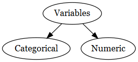
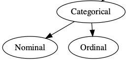
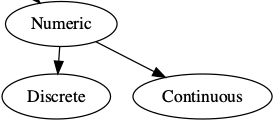

class: title-slide

```{r child = "../setup.Rmd"}
```

<br>
<br>
.right-panel[ 

# `r rmarkdown::metadata$title`
## `r rmarkdown::metadata$author`
## `r rmarkdown::metadata$coauthor`
]

---

```{r echo = FALSE, message=FALSE}
library(fivethirtyeight)
library(openintro)
library(tidyverse)
library(DiagrammeRsvg)
library(rsvg)
library(titanic)
```

## Variables

__Variables__: Characteristics of the individuals within the population.                                            

Variables can be classified into two groups: categorical or numeric.


```{r echo = FALSE, fig.align='center', out.width='50%'}

 
```

---

## Categorical Variables

__Categorical__ (qualitative) variables allows for individuals to be classified based on some attribute or characteristic.

* Variables such as `eye_color` (brown, blue, black, green, other), `own_car` (true, false), `class_year` (freshman, sophomore, junior, senior) are _categorical variables_. 

--

Categorical variables have __levels__ (categories). For instance `own_car` has two levels, and `class_year` has four levels.

---

## Numerical Variables

__Numeric__ (quantitative) variables provides numerical measures of individuals.

* Variables  such as `n_kids` (number of kids), `height`, and `course_units` are _numerical variables_. 

--

We can do certain analyses using these variables such as finding an average or the maximum or minimum.

--

Not everything represented by numbers represents a numeric quantity. e.g. student ID, cell phone number, zip code. 

---

### candy_rankings

```{r echo=FALSE, out.width='100%'}
knitr::include_graphics('img/data-candy.png')
```

--

Categorical variables: 

- `chocolate`, `fruity`

--

Numeric variables: 

- `sugarpercent`, `pricepercent`, `winpercent`

---

### Categorical Variables

Categorical variables can be further classified as either nominal or ordinal. 

* _Nominal_ variables have categories that do not follow a natural order. Hence, these can be ordered by alphabetical order or based on highest frequency, or any way that makes sense of the data being presented. 
    
    e.g. `eye_color`, `race`, `gender`

--

* _Ordinal_ variables have categories that have a natural order. 
    
    e.g. `course_grade`, `class_year`, `t-shirt_size`

```{r echo = FALSE, fig.align='center'}

 
```

---

### Numerical Variables

Numerical variables can be further classified as either continuous or discrete.                                           

* _Continuous_ variables are not countable and have an infinite number of possible values. Any decimal value make sense. Continuous variables can be measured to a certain precision, e.g. days, hours, minutes, seconds, ... 
    
    e.g. `weight`, `commute_time`

--

* _Discrete_ variables have a finite or countable number of possible values. 
    
    e.g. `n_kids`, `class_units`

```{r echo = FALSE, fig.align='center'}

 
```


---

```{r}
glimpse(candy_rankings)
```

---

```{r}
glimpse(mariokart)
```

---
class: middle

`character` (`chr`): takes string values (e.g. a person's name, address)  
--

`integer` (`int`): integer (single precision)  
--

`double` (`dbl`): floating decimal (double precision)   
--

`numeric` (`num`): integer or double  
--

`factor` (`fct`): categorical variables with different levels  
--

`logical` (`lgl`): TRUE (1), FALSE (0)  

---

class: inverse middle

As a data scientist it is .font30[**your**] job to check the type(s) of data that you are working with. 
  The type of variables you have will determine the type of analysis you will do. 

Do .font30[**not**]  assume you will work with clean data frames, with clean names, labels, and types. 


---

class: inverse middle

## Data Wrangling

  One of the first steps you'll do as a data scientist, is to determine if you have "clean" data, if you don't then it is a good idea to __tidy__ and __transform__ it to get the data in a form that is natural to work with. 
  
- __Tidying__ data means to put your data in a way that every column is a variable and every row is an observation.
    
- __Transformation__ includes narrowing in on observations of interest,  creating new variables that are functions of existing variables (like computing speed from distance and time), changing data types, and cleaning names. 
    
Together, tidying and transforming data is called __data wrangling__. 

---
## Data Types Activity

Download the "02b-data-types-activity.rmd" file from the Canvas activity, and answer the following questions using the `titanic_train` data frame.

1. How many observations are there in this data set?

2. How many variables are there in this data set?

3. Which variables are considered categorical? 

4. Which variables are considered numeric?

5. Determine if the type of data for each variable was read correctly by R, if not then specify the most appropriate type of variable that it should be. Use the help feature to find more information about the variables if needed. 
