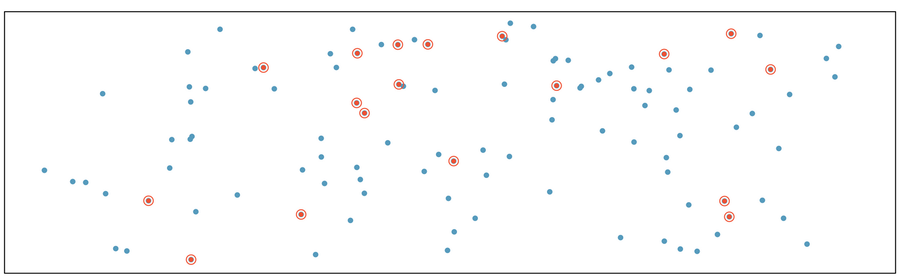
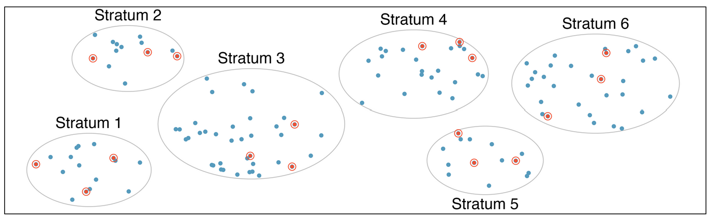
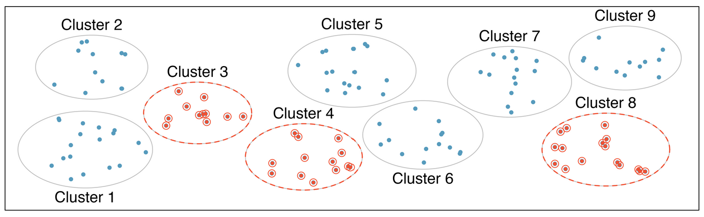

class: title-slide

```{r echo = FALSE, warning = FALSE, message = FALSE}
library(tidyverse)
library(janitor)

lapd <- read_csv("Police_Payroll.csv")
lapd <- clean_names(lapd)
```


<br>
<br>
.pull-right[ 

# `r rmarkdown::metadata$title`
## `r rmarkdown::metadata$author`

]

---

## Research Question


Do Cypress College students who exercise regularly have higher GPA?

--

## Relationship Between Two Variables

In research, we often want to examine the relationship between two variables.  

For instance, is there an association between exercising and having a higher GPA? 


---
## Relationship Between Two Variables

- The __response variable__ measures or records the outcome of the study. Denoted by $y$.
- The __explanatory variable__ may potentially explain changes in the response variable. It is any factor that can influence the response variable. Denoted by $x$.

Exercising may e**X**plain high GPA.

---

## Research Question

Do Cypress College students who exercise regularly have higher GPA?

--

### Population

Each research question aims to examine a __population__. 

Population for this research question is Cypress College (CC) students.


---

class: inverse middle

.font75[Types of Studies]

There are various ways of collecting data from the population. 

---

## Observational Study

In an __observational study__, data is recorded on individuals without attempting to influence the responses. 

- There is no treatment/intervention.
- Data is collected as is. 
- No control over factors.
- Causal relationships cannot not be made.

---

## Experimental Study 

An __experiment__ is a controlled study. 

- The researcher deliberately imposes a treatment on individuals.
- Responses are recorded at end of experiment to determine the effect of one or more explanatory variables (factors) on a response variable (outcome).


---

## Collecting Data for Observational Studies

Surveys are often used when collecting data for observational studies. 


### Survey Example

Based on our research question: Do Cypress College students who exercise regularly have higher GPA? We can ask the following questions. 

- Do you exercise at least once every week?

- What is your GPA?

---

## Sampling

When it is impossible or costly to get information from all individuals of the __population__ we take a __sample__. 

--

Since it would be almost impossible to give the survey to ALL CC students, we can give the survey to a sample of students. 

Let's say we want to select a sample of 100 students.

Population: All CC students  
Sample: 100 students who respond

---

## Generalizibility

The goal is to have a sample that is **representative** of the population. 

--

Why do we care to have a sample that is **representative** of the population?

--

- We want the findings of studies to be **generalizable** to the population.

--

This could only happen if **randomness** is involved in the process of selecting the sample. 

---

class: inverse middle

.font75[Sampling Techniques]

---

## Simple Random Sample

We can use __simple random sampling__ to select the sample. Using simple random sampling technique any sample of size n from the population has an equal chance of being selected.

--

.pull-left[
Methods: 
- Draw names out of a hat
- Use [table of random digits](https://www.google.com/search?q=table+of+random+digits)
- Use software/computer program such as RStudio
- [Random Number Generator](https://www.google.com/search?channel=cus2&client=firefox-b-1-d&q=random+number+generator)]

.pull-right[
```{r fig.align='center', out.width="90%", echo = FALSE}


```
]

.footnote[Image from [Intro to Modern Statistics 1st ed](https://openintro-ims.netlify.app/) licensed under the Creative Commons Attribution-ShareAlike 3.0 Unported United States License.]


---

### Example: Simple Random Sample

The researcher can 
- reach out to the registrar to get student emails. 
- randomly select 100 students.
- email them the survey.


---

### Taking random samples using R

We use the function `slice_sample(dataset, n = #)` to take a random sample of size `n` rows from our `dataset`. 

- The `set.seed()` function will be used prior to selecting our sample so that you generate the same sample as the instructor for checking work and grading purposes. The seed will always be given. 


```{r}
set.seed(12345)
sample_1 <- slice_sample(lapd, n = 10)

```


- Note that your random sample would contain the `n = 10` random rows selected form the data set.

---


```{r}
sample_1
```

---

- You can then work with or select the variable you want.

```{r}
sample_1$base_pay
mean(sample_1$base_pay)
```


---

## Stratified Random Sample

To obtain a __stratified random sample__, the population is divided into disjoint groups then obtaining a simple random sample from each group. The full sample is formed by combining the random samples. 


```{r fig.align='center', out.width="40%", echo = FALSE}

```

--

- The groups are divided based on a characteristic that classifies individuals based on the category they identify with. Hence individuals within each group tend to share a similar characteristic. 
- A stratified random sample guarantees that each group is represented in the sample.

.footnote[Image from [Intro to Modern Statistics 1st ed](https://openintro-ims.netlify.app/) licensed under the Creative Commons Attribution-ShareAlike 3.0 Unported United States License.]

---

### Example: Stratified Sample

The researcher can 
- reach out to the registrar to get student major and emails. 
- divide students based on their major.
- randomly select some students from each major for a total of 100 students. 
- email them the survey.

---

## Systematic Sample

 A __systematic sample__ is obtained by selecting every kth individual from the population. The first individual selected corresponds to a random number between 1 and k, then selecting every kth individual after that. 

--
  
- The researcher can decide on the K or estimate it by doing k = N/n, where N = population size and n = sample size. 

---

### Example: Systematic Sample

The researcher can 
- reach out to the registrar to get student emails. 
- randomly select a number between 1 and 120 and then select every 120th student from the list. This is assuming there are 12,000 students at Cypress College, and the researcher wants a sample of 100.  
- email them the survey.

---

## Cluster Sample

In a __cluster sample__ the population is divided in to groups called clusters, then selecting a random sample of clusters. The sample is composed of all individuals within the selected clusters.


```{r fig.align='center', out.width="40%", echo = FALSE}


```


--

- Individuals within the clusters have different characteristics. 


.footnote[Image from [Intro to Modern Statistics 1st ed](https://openintro-ims.netlify.app/) licensed under the Creative Commons Attribution-ShareAlike 3.0 Unported United States License.]

---

### Example: Cluster Sample

The researcher can 
- reach out to the registrar to get the schedule of classes.  
- randomly select 5 classes. 
- visit each class and obtain the students names and emails.   
- email the survey to all students in the 5 classes. 

---

## Convenience Sampling

__Convenience sampling__ is one where individuals are easily obtained and not based on randomness.

--

This could introduce __sampling bias__, which means that information obtained from the individuals in the sample tends to favor one part of the population over another.

---
### Example: Convenience Sampling

The researcher can
- stand next to the front door of the Library/Learning Resource Center (LLRC).
- give the survey to the first 100 CC students that go inside the LLRC.

This type of sample will have sampling bias because it is possible that those that go to the LLRC

- may study more and thus may have higher GPA.
- may be more active than those who study at home.

---

### Example: Convenience Sampling

To determine customer satisfaction at a retail store, every paying customer given a receipt is suggested to answer the survey printed in the back of their receipt and receive 10% discount on their next purchase. 

 - The sample is based on self-selection. Those who want to provide opinion provide it. Not a random sample!


```{r fig.align='center', out.width="30%", echo = FALSE}
knitr::include_graphics("https://cdn.pixabay.com/photo/2017/01/13/18/56/feedback-1977986_960_720.jpg")
```

Image by <a href="https://pixabay.com/users/Tumisu-148124/?utm_source=link-attribution&amp;utm_medium=referral&amp;utm_campaign=image&amp;utm_content=1977986">Tumisu</a> from <a href="https://pixabay.com/?utm_source=link-attribution&amp;utm_medium=referral&amp;utm_campaign=image&amp;utm_content=1977986">Pixabay</a>

---

## Non-response Bias

In either sampling example, it is unlikely that all students selected will respond. Assume that 86% respond. 

It is possible that those 14% who did not respond

- may be busy exercising and did not have the time to respond.
- may be busy studying and did not have the time to respond. 

--

This kind of bias is called __non-response bias__, meaning that individuals selected to be in the sample who do not respond to the survey have different characteristics from those who do. If the non-response rate is high then it is unclear whether the results are representative of the entire population. 

  Non-response can be improved through the use of callbacks/emailing repeated times or give rewards/incentives. 


---

## Response Bias

__Response bias__ occurs when the responses of the individuals in the sample do not reflect their true feelings. 

Reasons for response bias:
- Interviewer error
- Misrepresented answers
- Words used in survey question
- Question in the survey is very personal
- Order of the questions

---

### Exploring sampling methods 

For the following articles, scroll to the bottom of the report to find the survey or sampling methods. 

[Social Media and Teens](https://news.gallup.com/poll/512576/teens-spend-average-hours-social-media-per-day.aspx)

[Economic Well-being of U.S. Households](https://www.federalreserve.gov/publications/files/2023-report-economic-well-being-us-households-202405.pdf)

[President Trump's January Approval Numbers](https://maristpoll.marist.edu/polls/the-trump-administration-january-2025/)


