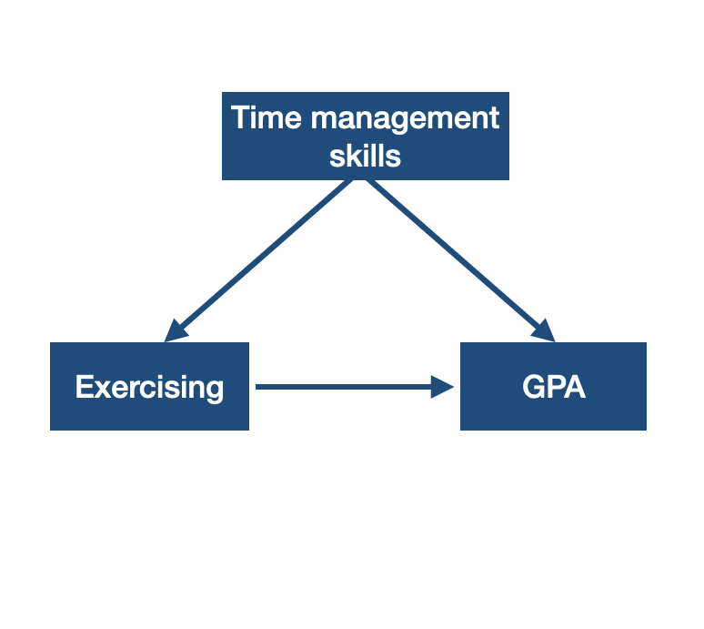
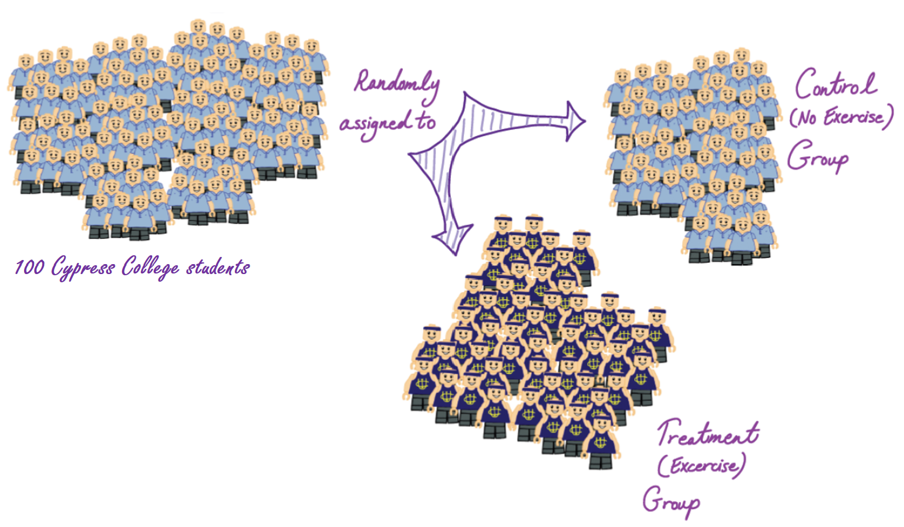
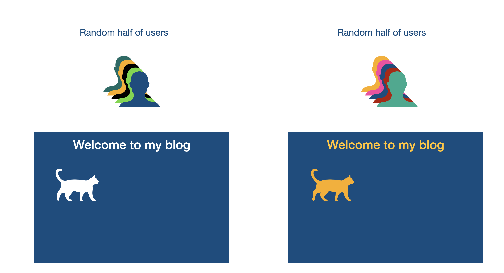
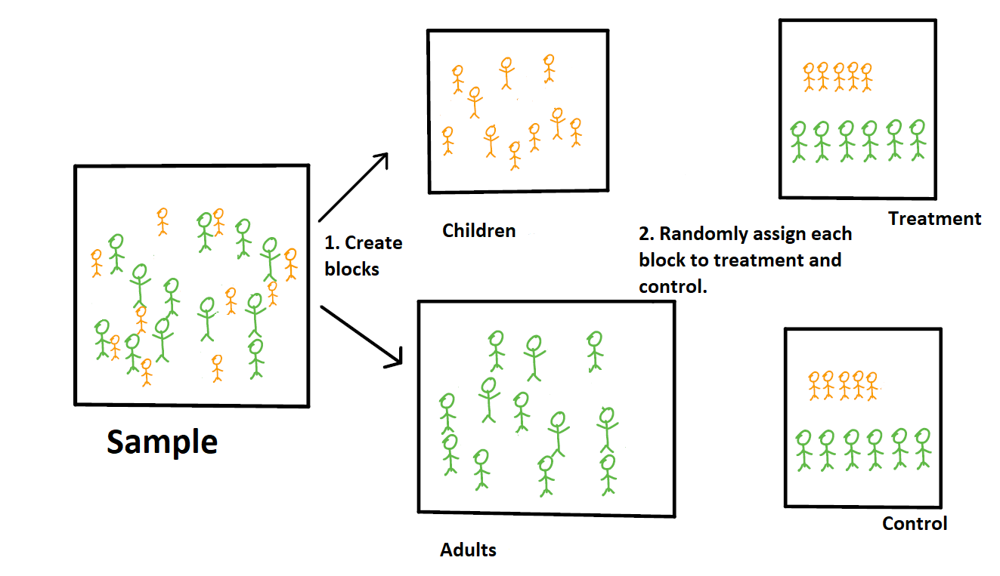

class: title-slide


<br>
<br>
.pull-right[ 

# `r rmarkdown::metadata$title`
## `r rmarkdown::metadata$author`

]

---

## Research Question


Do Cypress College students who exercise regularly have higher GPA?

--

## Relationship Between Two Variables

In the previous topic, we looked into how to collect samples to examine the relationship between two variables through observational studies. 

However, often times we want to know if the relationship between them is causal. In other words, does one variable __causes__ the other? 

With our research question, we wan to determining if exercising is the reason for higher GPA? 


---

Recall, that in an __observational study__, data is recorded on individuals without attempting to influence the responses. 

- There is no treatment/intervention.
- No attempting to influence the value either the response or explanatory variable.
- Data is collected as is. 
- No control over factors.
- __Causal relationships cannot not be made.__

Even if we observe that CC students who exercise regularly have higher GPA, we cannot conclude that regular exercise increases GPA.


---

.pull-left[
```{r echo = FALSE, out.width='90%'}

```
]

--

.pull-right[
A __confounding variable__ is an explanatory variable that was not considered in the study, but that affects the value of the response variable in the study. 

A confounding variable (e.g. time management skills) often times correlates with the the explanatory and the response variable.
]

---

### Rephrasing the Research Question

~~Do CC students who exercise regularly have higher GPA?~~

Does exercising regularly increase GPA for CC students?

---

## Relationship Between Two Variables

A relationship between two variables does not imply one causes the other. 

We need rigorously designed studies to make generalizations and to establish causal relationships.

---

## Experimental Study 

Recall, that an __experiment__ is a controlled study.

- The researcher deliberately imposes a treatment on individuals.
- Responses are recorded at end of experiment to determine the effect of one or more explanatory variables (factors) on a response variable (outcome).
- Commonly used to establish casual relationships. 

---

### Terminology Related to Experiments

In experiments, researchers assign cases (individuals) to treatments/interventions.

- A __treatment__ is a value or combination of values of the explanatory variable(s).

- A __control group__ is the set of individuals that are assigned to a fake treatment or no active treatment. It is often used as a baseline treatment that can be used to compare to other treatments.

---

### Terminology Related to Experiments 

- A __placebo__ is a fake treatment, that looks, smells, and tastes like the real treatment. 
  - Often treated as the baseline treatment that can be used to compare to the real treatments. 
  - Used to determine if the response to the actual treatment is due to the actual treatment and not the subject’s apparent treatment. 
  - If a patient shows an improvement by taking a placebo then this is called a __placebo effect__.

- In __blind__ studies, individuals do not know what treatment they receive. In __double blind__ studies individuals who receive the treatment and the researcher who provides the treatment do not know the type of the treatment the individuals are getting. 

---

class: inverse middle

.font75[Types of Experiments]

---

## Randomized Experiment

In order to reduce biases and establish a casual link between variables, we need to randomize the design of the experiment. 

In __randomized experiments__, researchers randomly assign cases to treatments/interventions. 


---

### Example 1 of Randomized Experiment

Does exercising regularly increase GPA for CC students?

```{r echo=FALSE, out.width='75%', fig.align='center'}

```

.footnote[Image Copyright Derenik Haghverdian. Used with permission.]

---

### Example 2 of Randomized Experiment 

__A/B testing__ is a randomized experiment that compares two versions (A and B) of a single variable. It is used to determining which variation performs better. 


- It is commonly used on measuring online activities such as revenue per user, click through rates for online ads, number of returning users.


```{r echo = FALSE, fig.align='center', out.width='50%'}

```

---

## Block Experiment

If researchers suspect that an additional variable may influence the response variable, then they may use __blocks__ determeined by characteristics within the variable.

In __block experiments__ cases are divided into groups, or blocks, prior to randomly assigned them to treatments. It is used to test hypotheses about differences between the groups.

---

### Example 1 of Block Experiment

A doctor has developed a drug called `i.d.s.` to treat some disease. She wants to know if patients who take drug `i.d.s.` are free of the disease for at least a year. The doctor suspects that the drug may affect adults and kids differently.

```{r echo=FALSE, out.width='50%', fig.align='center'}

```

.footnote[Image Copyright Federica Ricci. Used with permission.]

---

class: center middle

Federal regulations, state laws, and school policy require review and approval before researchers may conduct research involving human subjects.

[Institutional Review Board](https://research.uci.edu/compliance/human-research-protections/index.html)

---

## Random Sampling vs. Random Assignment

- Random sampling is used to select the sample from the population randomly. Random sampling allows for findings to be generalized to the population.

- Random assignment is used to put participants to treatment/intervention groups randomly in experiments. Random assignment allows us to make causal relationships.

