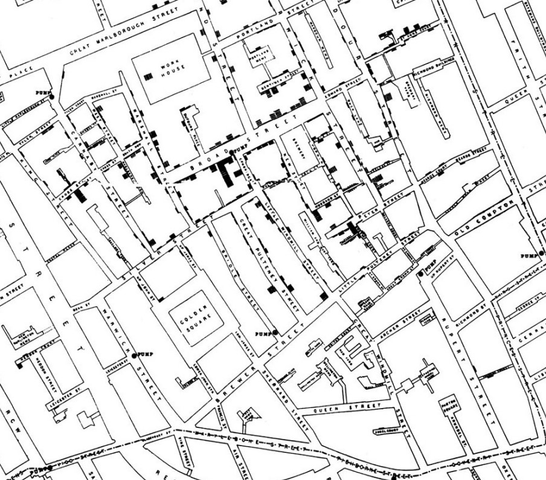

class: title-slide

```{r echo = FALSE, warning = FALSE}
library(fabricerin)
```

<br>
<br>
.right-panel[ 

# `r rmarkdown::metadata$title`
## `r rmarkdown::metadata$author`

]


---


class: middle

```{r echo=FALSE, out.width='70%'}
knitr::include_graphics('img/data-cycle.png')
```


Main components of data analysis: Visualization and Modeling

- **Visualization**: Looking at the overall picture to help you understand data. 

- **Model**: Mathematical or computational tool used to make predictions and answer very precise questions. 

.footnote[Image from Grolemund, G., & Wickham, H. (2018). R for data science (CC BY-NC-ND 3.0).]

---

### A picture is worth a thousand words (Fred R. Barnard)

.pull-left[
In 1854, cholera struck in the Soho district of London. A doctor named John Snow believed that water contaminated by sewage was the cause.  He recorded each death diligently using a street map of the district. Each black bar in the map represents one death.

]

.pull-right[
```{r echo=FALSE, out.width='80%'}

```

]

.pull-left[
Conclusion: the deaths are roughly clustered around the Broad Street pump.
]

Snow's map is one of the earliest and most powerful uses of data visualization. 

.footnote[Image from Adhikari, A., DeNero, J., and Wagner, D. (2022). Computational and Inferential Thinking (CC BY-NC-ND 4.0).]
---

class: middle

## Cool Visuals

[Orange County Data Dashboards](https://www.ochealthinfo.com/news-data/data-dashboards)

[Economic Well-Being of U.S. Households in 2023](https://www.federalreserve.gov/publications/files/2023-report-economic-well-being-us-households-202405.pdf)

[Why Time Flies](https://maximiliankiener.com/digitalprojects/time/)

[Mandatory Paid Vacation](https://www.instagram.com/p/CE1kpM5FhWR/?utm_source=ig_web_copy_link)

[Why are K-pop groups so big?](https://pudding.cool/2020/10/kpop/)

---

class: middle
# Visualization

Data Visualizations

- are graphical representations of data

--

- use different colors, shapes, and the coordinate system to summarize data

--

- tell a story

--

- are useful for exploring data

--

- help you raise new questions or hint that you’re asking the wrong question 

---

class: middle 

# Visualization

- In this class, we will create plots using the function _ggplot_ within the **ggplot2** system for making graphs.

--

- This specific lecture will focus on how ggplot works. 

--

- This lecture will not necessarily show you beautiful plots. 

--

- In the next lecture, we will improve the plots that we make.

---

center: invisible 
## ggplot

__gg__plot is a function that creates a coordinate system that you can add layers to, such as type of graph, labels, color, and much more. It is a function within the __gg__plot2 package, which is a system for creating graphics based on __g__rammar of __g__raphics.


ggplot2 is a package of the tidyverse. The tydiverse is a collection of R packages designed for data science. All packages share an underlying design philosophy, grammar, and data structures. 

---

### Resources 

[The Layered Grammar of Graphics](http://vita.had.co.nz/papers/layered-grammar.pdf) by Hadley Wickham.

```{r echo = FALSE}
knitr::include_graphics("img/grammar_graphics.jpeg")
```

A comprehensive introduction to the tydiverse is given in the free online book [R for Data Science](https://r4ds.had.co.nz/).

---

### Types of graphs: 

- One categorical variable -> **bar** plot, pie chart
- One numerical variable -> **histogram**, box plot, dot plot, stem-and-leaf plot
- Two categorical variables -> stacked bar plot, dodged bar plot
- Two numerical variables -> scatter plot (**point**)
- One numerical and one categorical variable -> violin graph, side-by-side box plots
- Two numerical and one or more additional variables -> scatter plot with points differentiated using scale, shape, and color based on numerical or categorical variables


