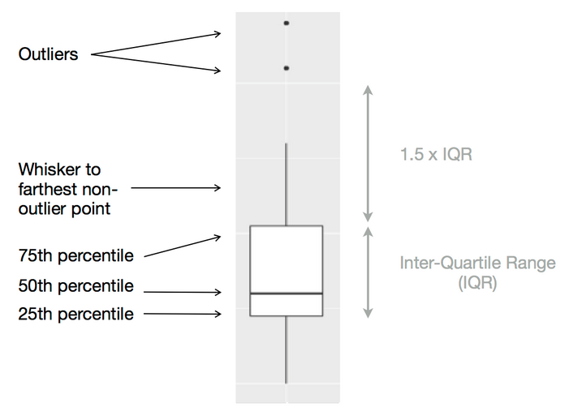
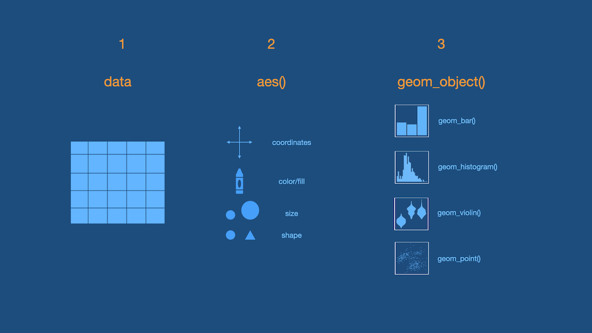

class: title-slide

```{r echo = FALSE, message=FALSE, warning = FALSE}
library(palmerpenguins)
library(tidyverse)
library(titanic)
library(janitor)
titanic <- titanic_train %>% 
  clean_names() %>% 
  select(survived, pclass, sex, age, fare, embarked) %>% 
  mutate(pclass = case_when(pclass == 1 ~ "First", 
                            pclass == 2 ~ "Second",
                            pclass == 3 ~ "Third"),
         embarked = case_when(embarked == "S" ~ "Southampton",
                              embarked == "C" ~ "Cherbourg",
                              embarked == "Q" ~ "Queenstown"),
         embarked = as.factor(embarked),
         sex = as.factor(sex),
         pclass = as.factor(pclass),
         survived = as.logical(survived))
```

<br>
<br>
.right-panel[ 

# `r rmarkdown::metadata$title`
## `r rmarkdown::metadata$author`

]


---

class:inverse middle

.font75[Visualizing a Single Categorical Variable]

We will visualize **categorical** variables using **barplots**.

---

## Data

```{r}
glimpse(titanic)
```

*Note:* The data frame has been cleaned for you.

---
class: middle

.left-panel[
## Barplot
<br>
In a **barplot** each bar represents a category within the variable, and the height of the bar is determined by the count or proportion of the category. 

]

.right-panel[

```{r echo=FALSE}
ggplot(titanic, aes(x = pclass)) +
  geom_bar()
```
]

---

class: middle

.left-panel[
## Barplot
<br>
If you could speak to R in English, how would you tell R to make this plot for you?

OR

If you had the data and had to draw this barplot by hand, what would you do?

]

.right-panel[

```{r echo=FALSE}
ggplot(titanic, aes(x = pclass)) +
  geom_bar()
```
]

---

class: middle

.left-panel[
Possible ideas

- Consider the data frame
- Count number of passengers in each `pclass`

```{r echo = FALSE}
titanic %>%
  count(pclass)
```

- Put `pclass` on x-axis.
- Put `count` on y-axis.
- Draw the bars.

]

--
.right-panel[

```{r echo=FALSE}
ggplot(titanic, aes(x = pclass)) +
  geom_bar()
```
]


---

class: middle

.left-panel[
<br>
<br>
These ideas are all correct but some are not necessary in R

- Consider the data frame
- ~~Count number of passengers in each `pclass`~~
- Put `pclass` on x-axis.
- ~~Put `count` on y-axis~~.
- Draw the bars.

R will do some of these steps by default. Making a barplot with another tool might look slightly different.

]

.right-panel[

```{r echo=FALSE}
ggplot(titanic, aes(x = pclass)) +
  geom_bar()
```
]

---

class: middle

**3 Steps of Making a Basic ggplot**

1. Pick data

2. Map data onto aesthetics

3. Add the geometric layer


---
class: middle

### Step 1 - Pick Data

.pull-left[
```{r eval = FALSE}
ggplot(data = titanic)
```
]

.pull-right[

```{r echo = FALSE, fig.height=5}
ggplot(titanic)
```

]

---

class: middle

### Step 2 - Map Data to Aesthetics

.pull-left[
```{r eval = FALSE}
ggplot(data = titanic,
       aes(x = pclass)) #<<
```
]

.pull-right[

```{r echo = FALSE, fig.height=5}
ggplot(data = titanic,
       aes(x = pclass))
```

]

---

class: middle

### Step 3 - Add the Geometric Layer

.pull-left[
```{r eval = FALSE}
ggplot(data = titanic,
       aes(x = pclass)) +
  geom_bar() #<<
```
]

.pull-right[

```{r echo = FALSE, fig.height=5}
ggplot(data = titanic,
       aes(x = pclass)) +
  geom_bar()
```
]
---
class: middle 

.left-panel[
### Plot
```{r echo = FALSE, fig.height=5, fig.align='center'}
ggplot(data = titanic,
       aes(x = pclass)) +
  geom_bar()
```

]
--

.right-panel[
### Three main steps

1. Call the ggplot() function on the data we want to plot.
2. Map variables to plot aesthetics using the aes() function.
3. Add a layer to specify the plot type


```{r eval = FALSE, fig.height=5}
    ggplot(data = titanic,
           aes(x = pclass)) +
      geom_bar()
```
]
---

class:inverse middle

.font75[Visualizing a Single Numerical Variable]

We will visualize **numerical** variables using **histograms** and **boxplots**.

---

class: middle

.left-panel[
## Histogram
<br>
 
A **histogram** is one of the most fundamental tools for exploring numeric data. It displays the distribution of a numeric variable by dividing the range of the variable into bins (intervals or classes) and showing the frequency of observations in each bin. 

]

.right-panel[

```{r echo=FALSE, message = FALSE}
ggplot(data = titanic,
       aes(x = fare)) +
  geom_histogram()
```
]


---

class: middle
## Histogram
How would you tell R to make this plot for you?

```{r echo = FALSE, fig.height=5, fig.align='center', message = FALSE}
ggplot(data = titanic,
       aes(x = fare)) +
  geom_histogram() 
```


---

class: middle

### Step 1 - Pick Data

.pull-left[
```{r eval = FALSE}
ggplot(data = titanic)
```
]

.pull-right[

```{r echo = FALSE, fig.height=5}
ggplot(titanic)
```

]

---

class: middle

### Step 2 - Map Data to Aesthetics

.pull-left[
```{r eval = FALSE}
ggplot(data = titanic,
       aes(x = fare)) #<<
```
]

.pull-right[

```{r echo = FALSE, fig.height=5}
ggplot(data = titanic,
       aes(x = fare))
```

]

---

class: middle

### Step 3 - Add the Geometric Layer

.pull-left[
```{r eval = FALSE}
ggplot(data = titanic,
       aes(x = fare)) +
  geom_histogram() #<<
```
]

.pull-right[

```{r echo = FALSE, fig.height=5}
ggplot(data = titanic,
       aes(x = fare)) +
  geom_histogram()
```
]


---

class: middle

.left-panel[
### Plot
```{r echo = FALSE, fig.height=5, fig.align='center'}
ggplot(data = titanic,
       aes(x = fare)) +
  geom_histogram() 
```

]

--

.right-panel[

### Three steps

  - Create a ggplot using the `titanic` data frame.
  - Map the `fare` to the x-axis. 
  - Add a layer of a histogram.

```{r eval = FALSE, fig.height=5}
    ggplot(data = titanic,
           aes(x = fare)) +
      geom_histogram() 
```
]

---

## What is this warning?

```{r echo = FALSE, fig.height=5, fig.align='center'}
ggplot(data = titanic,
       aes(x = fare)) +
  geom_histogram()
```

---

### binwidth = 15

```{r fig.height=5, fig.align='center'}
ggplot(data = titanic,
       aes(x = fare)) +
  geom_histogram(binwidth = 15) #<<
```


---

### binwidth = 50

```{r fig.height=5, fig.align='center'}
ggplot(data = titanic,
       aes(x = fare)) +
  geom_histogram(binwidth = 50) #<<
```


---

### binwidth = 100

```{r fig.height=5, fig.align='center'}
ggplot(data = titanic,
       aes(x = fare)) +
  geom_histogram(binwidth = 100) #<<
```


---

class: middle

[There is no "best" number of bins](https://en.wikipedia.org/wiki/Histogram#Number_of_bins_and_width)

- Using too few classes will cause a bunching effect (skyscrapers) and too many classes will spread the data out (pancake); Therefore, no pattern will be revealed. This is crucial when constructing a histogram.
- Experimenting with the binwidth is essential to determining the appropriate histogram for the data.
- Use the distribution that provides the best overall summary of the data, but at the same time shows important details.


---

### Skewness

Once a histogram is created we need to determine its skewness, meaning its overall shape and pattern to see if data tend to one side or the other and where the bulk of the data is located at. 

```{r echo = FALSE, out.width ="75%"}
knitr::include_graphics("img/skewness.PNG")
```

.footnote[Image from Dogucu, M, et all, (2025). Hello Data Science (CC BY-NC-ND 4.0).]

---

### Mean is not a good measure of center when the data are skewed

.pull-left[
```{r echo = FALSE, message = FALSE, fig.height=6}
ggplot(data = titanic,
       aes(x = fare)) +
  geom_histogram()
```
]

.pull-right[
```{r}
summarize(titanic,
          mean(fare),
          median(fare))
```
 
]

---

## Choosing the best numerical summary to represent data

```{r echo = FALSE, out.width="70%", fig.align='center'}
knitr::include_graphics("img/dist-shape.png")
```


- Use `mean` when distribution is roughly symmetric.

- Use `median` when distribution is skewed right or skewed left. 

.footnote[image from Kozak, K., (2015), Statistics Using Technology, 2nd edition, CC-By-SA]

  
---

##Boxplot

.pull-left[
A **boxplot** is a visual display of the five-number summary: **Minimum, Q1, Median, Q3, Maximum**.

In addition, a boxplot shows any potential **outliers**, which are values that deviate from the overall pattern of the distribution.
]

.pull-right[

```{r echo = FALSE, out.width="95%", fig.align='center'}

```

]

.footnote[image from Grolemund, G., & Wickham, H. (2018). R for data science (CC BY-NC-ND 3.0).]

---

## Boxplot

If were to create a boxplot by hand: 
  - find the five number summary: min, Q1, med, Q3, Max
  - find the **interquartile range** (IQR = Q3-Q1), the range of the middle 50% of the data.
  - use the **1.5(IQR) Rule for outliers**: find lower limit Q1-1.5(IQR) and upper limit Q3 +1.5(IQR). Any data values that are smaller than lower limit or larger than the upper limit are considered outliers.


---

### Example
Let's determine if fare has any potential outliers. 

#### Five-number summary:

```{r warning = FALSE}
summarize(titanic, 
          quantile(fare, c(0, 0.25, 0.5, 0.75, 1)))
```

---

#### IQR: 

```{r}
Q1 <- quantile(titanic$fare, c(0.25))
Q3 <- quantile(titanic$fare, c(0.75))
iqr <- Q3 - Q1
iqr
```

---

#### 1.5(IQR) Rule for outliers:

```{r}
Q1 - 1.5*iqr
Q3 + 1.5*iqr
```


Based on the limits, we know that there is at least one outlier, the maximum of `r max(titanic$fare)`.

---

## Boxplot

.pull-left[
To create a boxplot in R:
  - Create a ggplot using the data frame
  - Map the numerical variable to the one of the axes (horizontal: x-axis, vertical: y-axis) 
  - Add the geometric layer of a boxplot
 

```{r, eval = FALSE}
ggplot(titanic,
       aes(y = fare)) +
  geom_boxplot()
```
]

.pull-right[
```{r, echo = FALSE, message = FALSE, fig.height=6}
  ggplot(titanic,
    aes(y = fare)) +
  geom_boxplot()
```
]


---

class: middle center

## Adding color to histograms, barplots, and boxplots

Pick your favorite color(s) from the list at:

[bit.ly/colors-r](https://bit.ly/colors-r)

Color is added as an argument inside the geometric layer. 

`color = "color you want"`: colors the outline (borders) of the graph. 

`fill = "color you want"`: colors the inside of the graph.

---

```{r fig.align='center', fig.height=5}
ggplot(data = titanic,
       aes(x = fare)) +
  geom_histogram(binwidth = 50, 
                 color = "white", #<<
                 fill = "deeppink2") #<<
```

---

```{r fig.align='center', fig.height=5}
ggplot(data = titanic,
       aes(x = pclass)) +
  geom_bar(
           color = "black", #<<
           fill = "purple") #<<
```

---

```{r fig.align='center', fig.height=5}
ggplot(data = titanic,
       aes(y = fare)) +
  geom_boxplot(
           color = "black", #<<
           fill = "blue") #<<
```

---
## Intro to ggplot Activity

Download the "03b-intro-ggplot-one-variable-activity.rmd" file from the Canvas activity. Use the `titanic` data to answer the following questions. Use `?titanic_train` to find more information about the data set and its variables. 

1. Make a bar graph to determine the number of passengers that embarked at each of the destinations. What city had the most passengers that got on the Titanic?

2. Construct a histogram to look a the distribution for the age of the passengers. Pick a binwidth that you find appropriate and color it as you like.

3. Pick a variable of interest and create a graph. 

4. Explore other graphs, for a single variable, not covered in class.

---

```{r echo = FALSE, out.width ="75%"}

```

Downloadable [ggplot Cheat Sheet](https://github.com/rstudio/cheatsheets/blob/main/data-visualization-2.1.pdf)


