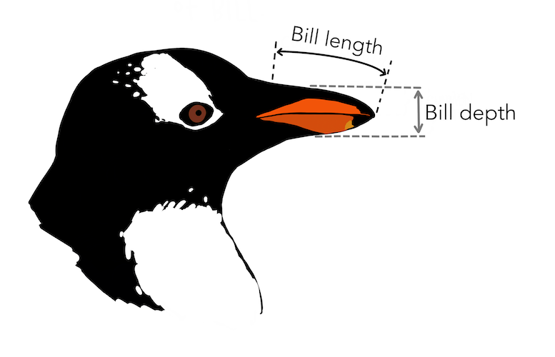

class: title-slide

```{r echo = FALSE, message=FALSE}
library(palmerpenguins)
library(tidyverse)
library(titanic)
library(janitor)
titanic <- titanic_train %>% 
  clean_names() %>% 
  select(survived, pclass, sex, age, fare, embarked) %>% 
  mutate(pclass = case_when(pclass == 1 ~ "First", 
                            pclass == 2 ~ "Second",
                            pclass == 3 ~ "Third"),
         embarked = case_when(embarked == "S" ~ "Southampton",
                              embarked == "C" ~ "Cherbourg",
                              embarked == "Q" ~ "Queenstown"),
         embarked = as.factor(embarked),
         sex = as.factor(sex),
         pclass = as.factor(pclass),
         survived = as.logical(survived))
```

<br>
<br>
.right-panel[ 

# `r rmarkdown::metadata$title`
## `r rmarkdown::metadata$author`
]

---

class: inverse middle

.font75[Visualizing Two Categorical Variables]

When we have two categorical variables, we want to understand how the categories of one variable are distributed within the categories of another. 

- Stacked Barplot
- Dodged (Side-by-Side) Barplot
- Standardize Barplot

---

## Stacked Barplot

A **stacked barplot** shows both the overall distribution of one variable and how it breaks down based on the second variable.

```{r eval = FALSE}
ggplot(data = data_name,
       aes(x = cat_variable1, 
           fill = cat_variable2)) + #<<
  geom_bar() 
```

The code `fill = cat_variable2` inside the `aes()` function will use the specified categorical variable2 to break up the main categorical variable1 assigned to the x-axis.


---

## Stacked Barplot

.pull-left[

```{r eval = FALSE}
ggplot(data = titanic,
       aes(x = pclass, 
           fill = survived)) + #<<
  geom_bar() 
```

]

.pull-right[

```{r echo = FALSE, fig.height=5}
ggplot(data = titanic,
       aes(x = pclass, 
           fill = survived)) +
  geom_bar()
```
]


---

## Standardized Barplot

In a **standardized barplot** each bar is scaled to the same height representing 100% of observations per bar, and the colored segments show the relative proportions of each category within each bar group. This visualization is useful for comparing the distribution patterns across categories, as it eliminates the effect of different group sizes and focuses purely on proportional relationships.

```{r eval = FALSE}
ggplot(data = data_nam,
       aes(x = cat_variable1, 
           fill = cat_variable2)) + 
  geom_bar(position = "fill") #<<
```

The code `position = "fill"` inside the geometric layer, will convert the counts into proportions within each of the categories. Hence, note that the y-axis is should no longer be a count, but a proportion.


---

## Standardized Bar Plot

.pull-left[

```{r eval = FALSE}
ggplot(data = titanic,
       aes(x = pclass, 
           fill = survived)) + 
  geom_bar(position = "fill") #<<
```

For example: About 25% of those traveling in third class survived the trip on the Titanic. Whereas, about 60% of those traveling in first class survived the trip.

]

.pull-right[

```{r echo = FALSE, fig.height=5}
ggplot(data = titanic,
       aes(x = pclass, 
           fill = survived)) +
  geom_bar(position = "fill")
```


]


---

## Dodged (side-by-side) Barplot

In a **dodged barplot**, bars are placed side-by-side rather than stacked. The grouped layout allows for direct visual comparison of bar heights both within and across groups.

```{r eval = FALSE}
ggplot(data = data_name,
       aes(x = cat_variable1, 
           fill = cat_variable2)) + 
  geom_bar(position = "dodge") #<<
```

The code `position = "dodge"` inside the geometric layer, will break up the main categorical variable assigned to the x-axis into side-by-side bars. 

---

## Dodged (side-by-side) Bar Plot

.pull-left[

```{r eval = FALSE}
ggplot(data = titanic,
       aes(x = pclass, 
           fill = survived)) + 
  geom_bar(position = "dodge") #<<
```

]

.pull-right[

```{r echo = FALSE, fig.height=5}
ggplot(data = titanic,
       aes(x = pclass, fill = survived)) +
  geom_bar(position = "dodge")
```

]


---

class: middle inverse

.font75[Visualizing One Numerical and One Categorical variable]

When we want to explore the relationship between a categorical variable and a numerical variable, we need visualization techniques that can show how the distribution of the numerical variable differs across the categories. 

- side-by-side boxplots

---

## New Data

```{r echo = FALSE, fig.align='center', fig.height=0.3}

```

.footnote[Artwork by [@allison_horst](https://twitter.com/allison_horst) ]

---

## New Data

```{r}
glimpse(penguins)
```

---

```{r echo = FALSE, fig.align='center'}

```

.footnote[Artwork by [@allison_horst](https://twitter.com/allison_horst) ]


---

### Side-by-Side Boxlot

In a **side-by-side boxplot** we create separate boxplots for each category of the categorical variable, allowing us to compare the distribution of the numerical variable across different groups. 


```{r eval = FALSE}
    ggplot(data_name,
           aes(x = cat_variable,
               y = num_variable))  +
      geom_boxplot() #<<
```

We can reverse the x and y assignments and create horizontal boxplots.

---

class: middle 

### Side-by-Side Boxlot

.pull-left[

```{r echo = FALSE, fig.height=5, fig.align='center', warning=FALSE}
ggplot(penguins,
       aes(x = species,
           y = bill_length_mm))  +
  geom_boxplot()
```

]

.pull-right[

```{r eval = FALSE, fig.height=5}
    ggplot(penguins,
           aes(x = species,
               y = bill_length_mm))  +
      geom_boxplot() #<<
```

]


---

.pull-left[
```{r echo = FALSE, message = FALSE, warning = FALSE}
ggplot(penguins,
       aes(x = species,
           y = bill_length_mm))  +
  geom_boxplot() +
  theme(text = element_text(size=20))

```

]

.pull-right[
```{r echo = FALSE, message = FALSE, warning = FALSE}
ggplot(penguins,
       aes(x = bill_length_mm))  +
  geom_histogram() +
  facet_wrap(~species) +
  coord_flip() +
  theme(text = element_text(size=20))

```
]

---
class: inverse middle

.font75[Visualizing Two Numerical Variables]

- Scatter Plot

---

## Scatter Plot

In a scatter plot we want to explore how the values of one variable are associated with the values of another. Each point represents an observation, and its location shows the combination of values for both variables for that particular observation.

```{r eval = FALSE}
ggplot(data_name,
       aes(x = num_variable,
           y = num_variable))  +
  geom_point() #<<
```

Note that to create a scatter plot, the added geometric layer is that of a `geom_point()`.

---
## Scatter Plot

.pull-right[

```{r fig.height = 5, echo = FALSE, warning = FALSE}
ggplot(penguins,
       aes(x = bill_depth_mm,
           y = bill_length_mm))  +
  geom_point()
```

]

.pull-left[

```{r eval = FALSE}
ggplot(penguins,
       aes(x = bill_depth_mm,
           y = bill_length_mm))  +
  geom_point() #<<
```

]


---

### How to assign variable to the x and y axes? 

When we look at two variables, we often want to explore their relationship. We often think of y as a function of x, meaning that y is the one that could possibly react or change based on changes in x. Hence x is called the **explanatory variable**; whereas y is called the **response variable**.

To classify the variables, we need context or information on how one would affect or influence the other. 

  - For example, the number of hours a student studies for an exam would likely influence their exam score. In this case, x = number of hours, and y = exam score.  

If there is no clear or logical understanding of this relationship then it's up to the researcher to assigned them. 

---

class: middle inverse

.font75[Visualizing Two Numerical and One or Two Categorical Variables]


- We can create a scatter plot with two numerical variables then group the points based on the categories of a categorical variable using color or shape or both.

---

### Grouping points using color

.left-panel[

```{r eval = FALSE}
ggplot(penguins,
       aes(x = bill_depth_mm,
           y = bill_length_mm,
           color = species)) + #<<
  geom_point()
```

We can group the points based on a categorical variable by assigning the categorical variable to the color argument in the aesthetics. We enter `color = "cat_variable"` inside the `aes()` function.
]

.right-panel[

```{r echo = FALSE, warning = FALSE}
ggplot(penguins,
       aes(x = bill_depth_mm,
           y = bill_length_mm,
           color= species))  +
  geom_point(size = 3)
```

]

---

### Grouping points using shape

.left-panel[

```{r eval = FALSE}
ggplot(penguins,
       aes(x = bill_depth_mm,
           y = bill_length_mm,
           shape = species)) + #<<
  geom_point()
```

To group the points based on a shape, we assign the categorical variable to the shape aesthetics. We enter `shape = "cat_variable"` in the `aes()` function. ggplot2 will only use six shapes at a time; additional groups will go unplotted.

]

.right-panel[

```{r echo = FALSE, warning = FALSE}
ggplot(penguins,
       aes(x = bill_depth_mm,
           y = bill_length_mm,
           shape = species))  +
  geom_point(size = 3)
```

]

---

### Grouping using both color and shape

.left-panel[
 
```{r eval = FALSE}
ggplot(penguins,
       aes(x = bill_depth_mm,
           y = bill_length_mm,
           shape = species, #<<
           color = island)) + #<<
  geom_point()
```

Grouping the points using both `color` and `shape` based on two categorical variables.
]

.right-panel[

```{r echo = FALSE, warning = FALSE}
ggplot(penguins,
       aes(x = bill_depth_mm,
           y = bill_length_mm,
           shape = species,
           color = island))  +
  geom_point(size = 3)
```

]


---

class: middle inverse

.font75[Visualizing Three Numerical Variables]

- We can create a scatter plot with two numerical variables then distinguish the size of the points based on a third numerical variable. 

---

.left-panel[
```{r eval = FALSE}
ggplot(penguins,
       aes(x = bill_depth_mm,
           y = bill_length_mm,
           size = body_mass_g)) + #<<
  geom_point()
```

We can distinguish the size of the points by assigning a numerical variable to the size aesthetics. We enter `size = "num_variable"` inside the `aes()` function.

]

.right-panel[

```{r echo = FALSE, warning = FALSE}
ggplot(penguins,
       aes(x = bill_depth_mm,
           y = bill_length_mm,
           size = body_mass_g)) +
  geom_point()
```
]


---

class: middle inverse

.font75[Visualizing Three Numerical and One or two Categorical Variables]

We can create a scatter plot with two numerical variables then:

- group the points based on categorical variables using color or shape or both.
- distinguish the size of the points based on a numerical variable. 


---

.left-panel[

```{r eval = FALSE}
ggplot(penguins,
       aes(x = bill_depth_mm,
           y = bill_length_mm,
           shape = species, #<<
           size = body_mass_g)) + #<<
  geom_point()
```

Grouping the points using `shape` based on a categorical variable and distinguishing the `size` of the points based on a numerical variable.
]

.right-panel[

```{r echo = FALSE, warning = FALSE}
ggplot(penguins,
       aes(x = bill_depth_mm,
           y = bill_length_mm,
           shape = species, 
           size = body_mass_g)) +
  geom_point()
```
]


---

.left-panel[

```{r eval = FALSE}
ggplot(penguins,
       aes(x = bill_depth_mm,
           y = bill_length_mm,
           shape = species, #<<
           color = island, #<<
           size = body_mass_g)) + #<<
  geom_point()
```

Grouping the points using both `color` and `shape` based on categorical variables and distinguishing the `size` of the points based on a numerical variable.
]

.right-panel[

```{r echo = FALSE, warning = FALSE}
ggplot(penguins,
       aes(x = bill_depth_mm,
           y = bill_length_mm,
           shape = species,
           color = island,
           size = body_mass_g)) +
  geom_point()
```
]


---

```{r echo = FALSE, out.width ="75%"}
knitr::include_graphics("img/ggplot-summary.jpeg")
```

Downloadable [ggplot Cheat Sheet](https://github.com/rstudio/cheatsheets/blob/main/data-visualization-2.1.pdf)


