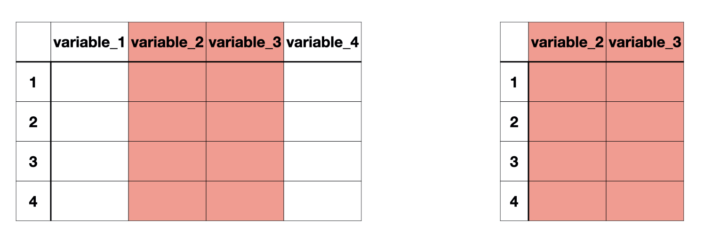
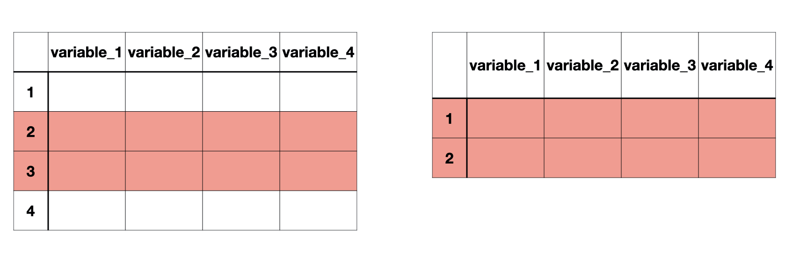

class: title-slide

```{r child = "setup.Rmd"}
```


```{r echo = FALSE, message = FALSE, warning = FALSE}
library(tidyverse)
library(janitor)
options(scipen = 999)
```


<br>
<br>
.right-panel[ 

# `r rmarkdown::metadata$title`
## `r rmarkdown::metadata$author`
]

---

### Data

```{r message = FALSE}
lapd <- read_csv("Police_Payroll.csv")
glimpse(lapd)
```

---

## Cleaning variable names to fit Tidyverse style

Recall, `clean_names` is a function from the Janitor package. It will convert names to tidy style: all lower case and with underscores in place of spaces.

```{r}
lapd <- clean_names(lapd)
glimpse(lapd)
```


---

### Importing data and cleaning names using `pipe operator |>`

```{r eval = FALSE, message = FALSE}
lapd <- read_csv("Police_Payroll.csv") |> 
    janitor::clean_names()
```

---

```{r}
colnames(lapd)
```

---

## subsetting variables/columns

```{r echo = FALSE, out.width="80%"}

```


`select()` is used to select the variables we want to keep from the data frame. The first argument is the dataset followed by the list of variables we want. 

This is useful when working with large datasets that contain many variables, but you only need a few for your specific analysis. The resulting data frame would have the **chosen columns** and keep **all the rows**.


---


.left-panel[

### data as first argument

```{r}
select(lapd, year, base_pay)
```
]

--

.right-panel[

### data is piped

```{r}
lapd |> 
  select(year, base_pay)
```

]

---

`select` can also be used to drop certain variables if used with a negative sign.

```{r}
select(lapd, -row_id, -department_title)
```

---

or we can use the exclamation mark (!) with the `c()` function to list the ones we want to drop. 

```{r}
select(lapd, !c(row_id, department_title))
```

---

### Selection helpers

These functions are used as an argument in the `select()` function to narrow it down to the specified variables you want. 

`starts_with()`  
`ends_with()`  
`contains()`  

---

`starts_with()` 

```{r}
select(lapd, starts_with("q"))
```

---

`ends_with()`  

```{r}
select(lapd, ends_with("pay"))
```

---

`contains()`

```{r}
select(lapd, contains("pay"))
```


---

## Subsetting observations/rows

```{r echo = FALSE, out.width="80%"}

```

`slice()` and `filter()` 

---

The `slice()` function allows us to examine (subset) rows by their position (**row number**) in the dataset.


The data below includes all the rows from third to seventh. Including third and seventh.

```{r}
slice(lapd, 3:7)
```

---

The `filter()` function allows us to subset rows based on **conditions**, while keeping all the columns.

We use relational and logical operators to create these conditions.

.pull-left[

### Relational Operators in R


| Operator | Description              |
|----------|--------------------------|
| <        | Less than                |
| >        | Greater than             |
| <=       | Less than or equal to    |
| >=       | Greater than or equal to |
| ==       | Equal to                 |
| !=       | Not equal to             |

]

.pull-right[

### Logical Operators in R

| Operator | Description |
|----------|-------------|
| &        | and         |
| &#124;   | or          |

]

---

### Examples


Q1. According to [datausa.io](https://datausa.io/profile/geo/los-angeles-ca#:~:text=In%202018%2C%20Los%20Angeles%2C%20CA,%2462%2C474%2C%20a%203.78%25%20increase.) Los Angeles had a median household income of $62474 in 2018. How many LAPD staff members had a base pay higher than $62474 in year 2018 according to this data?

.footnote[Median household income is **not** the same thing as median employee income. Our aim is data wrangling and not necessarily statistical analysis for now.]

--

```{r}
lapd |> 
  filter(year == 2018 & base_pay > 62474)
```


---

We can pipe the filtered data into the `nrow()` function to only obtain the number of observations that satisfy the stated condition. 

```{r}
lapd |> 
  filter(year == 2018 & base_pay > 62474) |> 
  nrow()
```

According to this data, `r lapd |> filter(year == 2018 & base_pay > 62474) |> nrow()` LAPD staff members had a base pay higher than $62474 in the year 2018.

---

Q2. How many observations are available between 2013 and 2015 including 2013 and 2015?

--

```{r}
lapd |> 
  filter(year >= 2013 & year <= 2015)
```

---

Q2. How many observations are available between 2013 and 2015 including 2013 and 2015?


```{r}
lapd |> 
  filter(year >= 2013 & year <= 2015) |> 
  nrow()
```

There are `r lapd |> filter(year >= 2013 & year <= 2015) |> nrow()` observations are available between 2013 and 2015 including 2013 and 2015.

---

Q3. How many LAPD staff were employed full time in 2018?


--

```{r}
lapd |> 
  filter(employment_type == "Full Time" & year == 2018) |> 
  nrow()
```


There were `r lapd |> filter(employment_type == "Full Time" & year == 2018) |> nrow()` LAPD staff were employed full time in 2018.

---

We have done all sorts of selections, slicing, filtering on `lapd` data but it has not changed at all. Why do you think that is?

```{r}
glimpse(lapd)
```

---

When selecting variables or filtering observations or both, there are two ways to go about saving the new filtered data: 

- assign it to a new data set name, keeping the original data set intact
- assign it to the same name, overriding the original data set


Also, when doing both, selecting variables and filtering observations, there is a correct order of doing it. We must __first filter__ the observations and __then select__ the desired variables. 


---

Suppose that we wanted to only focus on the year 2018, and the variables `job_class_title`, `employment_type`, and `base_pay`. Let's subset our data accordingly and assign it to `lapd`.

--

First, we subset the data to include the year 2018, and the variables `job_class_title`, `employment_type`, and `base_pay`.
```{r}
lapd |> 
  filter(year == 2018) |> 
  select(job_class_title, 
         employment_type, 
         base_pay)
```

---

Once we finalized our selection, we can then assign subset data to `lapd`. 
```{r}
lapd <- 
  lapd |> 
  filter(year == 2018) |> 
  select(job_class_title, 
         employment_type, 
         base_pay)
```

---

```{r}
glimpse(lapd)
```


