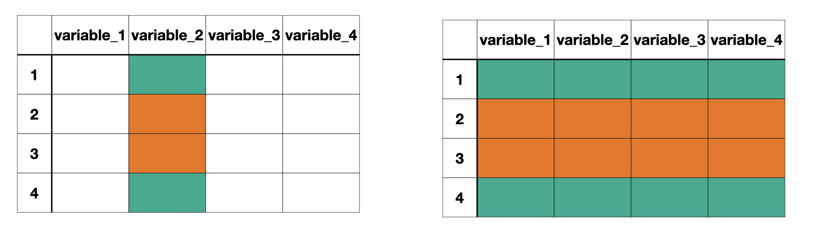

class: title-slide

```{r child = "setup.Rmd"}
```


```{r echo = FALSE, message = FALSE, warning = FALSE}
library(tidyverse)
library(janitor)
options(scipen = 999)
```


<br>
<br>
.right-panel[ 

# `r rmarkdown::metadata$title`
## `r rmarkdown::metadata$author`

]


---

class: middle

```{r echo = FALSE, message = FALSE}
lapd <- 
  read_csv("Police_Payroll.csv") |> 
  clean_names() |> 
  filter(year == 2018) |> 
  select(job_class_title, 
         employment_type, 
         base_pay) |> 
  mutate(employment_type = as.factor(employment_type),
           job_class_title = as.factor(job_class_title)) 
```


.pull-left[
## Data
Observations
]

.pull-left[
## Aggregated Data
Summaries of observations
]

---

class: middle

Recall that categorical data can be summarized with counts or proportions. 


```{r}
lapd |> 
  count(employment_type)
```

---

class: middle

Whereas, numerical variables can be summarized with means, medians, standard deviations, five-number summary, ...

```{r}
lapd |>
  summarize(mean(base_pay), median(base_pay))
```

---
class: middle

But what if we wanted to find numerical summaries for each of the categories in a categorical variable? 

---


class: inverse middle

.font75[Aggregating Data by Groups]

---

Often we want to calculate statistics for different groups in our data.

We can find numerical summaries for each category of a categorical variable using the function `group_by()` to first group observations based on their corresponding category and then finding the numerical summary we want using the `summarize()` function. 

`group_by(data, variable)`

```{r echo = FALSE, out.width="80%", fig.align='center'}

```

---

### Example

What is the median salary for each employment type?

--

First, we group individuals based on their employment type.

```{r}
lapd |> 
  group_by(employment_type)
```

---

Then, we find the median salary for base_pay. 

```{r}
lapd |> 
  group_by(employment_type) |> 
  summarize(med_base_pay = median(base_pay))
```

---

We can also remind ourselves how many staff members there were in each group using the function `n()`, but only works inside `summarize()` and `mutate()`.

```{r}
lapd |> 
  group_by(employment_type) |> 
  summarize(med_base_pay = median(base_pay),
            n = n())
```


---

### Boxplot comparing the median salary per employment type

.pull-left[

```{r eval = FALSE}
  ggplot(lapd,
    aes(x = employment_type,
        y = base_pay)) +
  geom_boxplot() +
  labs(title = "Comparing Median Slary per Employment Type", 
       x = "Employment Type", y = "Base Pay") +
  theme_bw()

```
]

.pull-right[
```{r echo = FALSE}
  ggplot(lapd,
    aes(x = employment_type,
        y = base_pay)) +
  geom_boxplot() +
  labs(title = "Comparing Median Slary per Employment Type", 
       x = "Employment Type", y = "Base Pay") +
  theme_bw()
```
]


