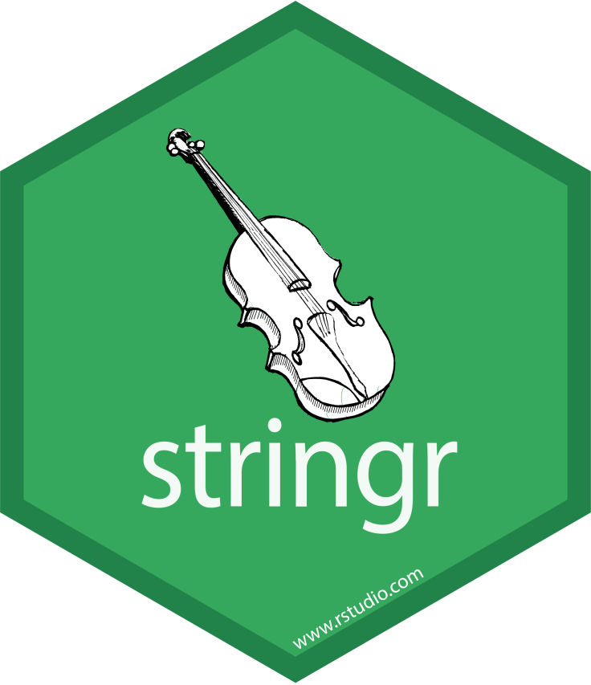

class: title-slide


<br>
<br>
.pull-right[ 

# `r rmarkdown::metadata$title`
## `r rmarkdown::metadata$author`
]


```{r echo = FALSE, message=FALSE}
library(tidyverse)
```

---

## What is a string?

A string is a data type used to represent text rather than numbers. It is a sequence of characters and can contain letters, numbers, symbols and even spaces. __It must be enclosed in quotation marks for it to be recognized as a string.__ 

You can create a string using either single quotes (') or double quotes ("). There’s no difference in behavior between the two, so in the interests of consistency, the tidyverse style guide recommends using ", unless the string contains multiple ".

```{r}
string1 <- "This is a string"
string2 <- 'If I want to include a "quote" inside a string, I use single quotes'
```


---

class: middle center

[Friends](https://www.imdb.com/title/tt0108778)

__Storyline:__
Ross Geller, Rachel Green, Monica Geller, Joey Tribbiani, Chandler Bing, and Phoebe Buffay are six twenty-somethings living in New York City. Over the course of 10 years and seasons, these friends go through life lessons, family, love, drama, friendship, and comedy.

---
## Data

```{r message = FALSE}
friends <- read_csv("friends.csv")
glimpse(friends)
```

```{r echo = FALSE, eval = FALSE, message = FALSE}
friends <- read_csv("https://raw.githubusercontent.com/ics80-fa21/website/main/slides/data/friends.csv")
glimpse(friends)
```

---

Let's look at descriptions only. 

```{r}
friends$description
```

---

Let's look at first description only and assign it to `first_episode_des`.

```{r}
friends$description[1]
```

--

```{r}
first_episode_desc <- friends$description[1]
```


---

```{r echo = FALSE, fig.align='center', out.width="40%"}


```

---

Base R contains many functions to work with strings but they can be inconsistent. 

To work with strings, we’ll use functions from `stringr` package which is part of Tidyverse. Functions in this package have very intuitive names, and all start with `str_`.

Note that the first argument is a character vector. 

```{r eval=FALSE}
str_something(some_character_vector, ....)
```


---

class: inverse middle

.font75[str_length()]

Returns the length of string, including spaces.

---


```{r}
string1 <- "This is a string"
string2 <- 'If I want to include a "quote" inside a string, I use single quotes'
```


```{r}
str_length(string1)
str_length(string2)
```

---

Which episode has the longest description?

```{r}
str_length(friends$description)
```

This code gives the lengths of all the episodes. 
---

Which episode has the longest description?

```{r}
max(str_length(friends$description))
```

This code gives the maximum length, but it doesn't show which episode or episodes.
---

Which episode has the longest description?

```{r}
friends |> 
  filter(str_length(description) == max(str_length(description)))
```

This is what we are looking for: the list of episodes with the longest descriptions. But note that you don't know how long that is. 

---

What is the length of the longest descriptions?

```{r}
friends |> 
  filter(str_length(description) == max(str_length(description))) |> 
  select(description) |> 
  pull() |> 
  str_length()
```

---

class: inverse middle

.font75[str_sub()]

Takes a subset of string characters. 

---

```{r}
first_episode_desc
```

--

```{r}
# 2nd to 8th character
str_sub(first_episode_desc, 2, 8)
```

--

```{r}
# 4th to fifth-to-last character 
str_sub(first_episode_desc, 4, -5)
```

---

class: middle inverse

.font75[str_to_lower()]  

Converts all letters to lower case.

.font75[str_to_upper]

Converts all letters to upper case. 

---

```{r}
str_to_lower(first_episode_desc)
```

--

```{r}
str_to_upper(first_episode_desc)
```


---

Change all the titles to capital letters.

```{r}
friends |> 
  mutate(title = str_to_upper(title))
```

---
class: middle inverse

.font75[str_detect()] 

Determines if a string has a specific set of characters. 


---

Does the first episode description contains "Rachel"?

```{r}
str_detect(first_episode_desc, "Rachel")
```

--

Does the first episode description contains "Ross"?

```{r}
str_detect(first_episode_desc, "Ross")
```


---

How many episodes have "Phoebe" in the description?

```{r}
str_detect(friends$description, "Phoebe") 
```

---

```{r}
str_detect(friends$description, "Phoebe") |> 
  sum()
```

---

How many episodes DO NOT have "Phoebe" in the description?

```{r}
(!str_detect(friends$description, "Phoebe")) |> 
  sum()
```


---

class: inverse middle

.font75[str_split()]

Splits a string specified by a boundary.

---

### by "word"

```{r}
str_split(first_episode_desc, boundary("word"))
```

---

### by "character"

```{r}
str_split(first_episode_desc, boundary("character"))
```

---

class: inverse middle

.font75[str_replace()]

Replaces a string of characters with another. 

---

### Example

Replace "Monica" with "Monika".

```{r}
str_replace(first_episode_desc, "Monica", "Monika")
```


---

class: center middle

[stringr cheatsheet](https://github.com/rstudio/cheatsheets/raw/master/strings.pdf)
