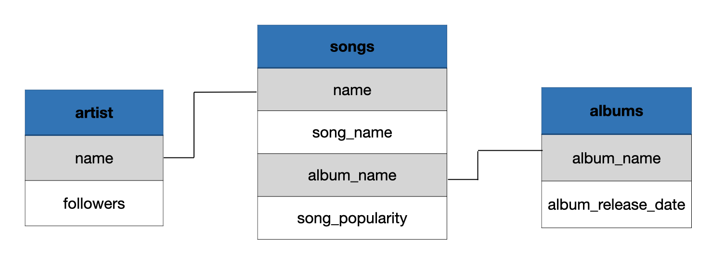
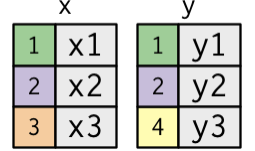
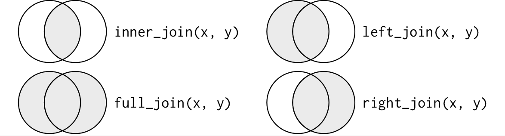
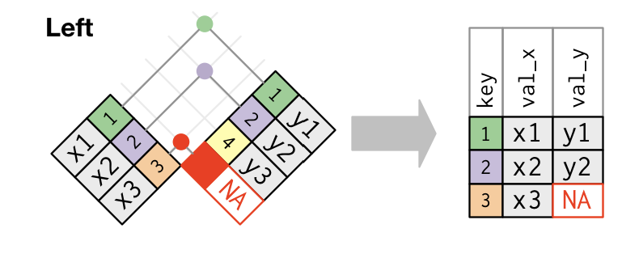
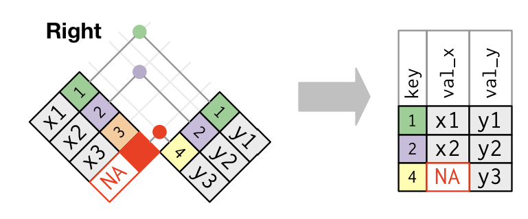
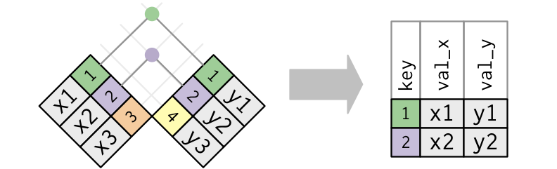
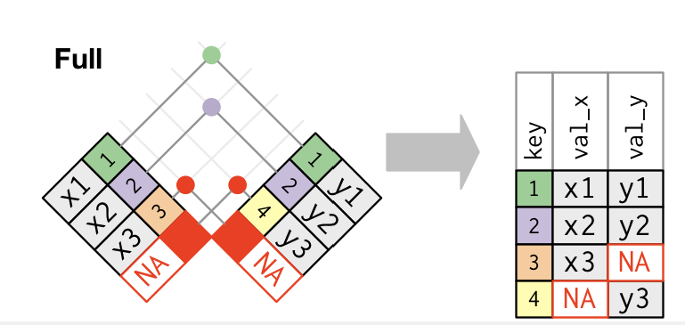

class: title-slide

```{r child = "setup.Rmd"}
```


```{r echo = FALSE, message = FALSE}
library(tidyverse)
options(scipen = 999)
xaringanExtra::use_panelset()

artists <- readxl::read_xlsx("spotify.xlsx", sheet = "artist")
songs <- readxl::read_xlsx("spotify.xlsx", sheet = "top_song")
albums <- readxl::read_xlsx("spotify.xlsx", sheet = "album") |> 
  mutate(album_release_date = lubridate::ymd(album_release_date))
```


<br>
<br>
.right-panel[ 

# `r rmarkdown::metadata$title`
## `r rmarkdown::metadata$author`
## `r rmarkdown::metadata$coauthor`
]


---

## Keys

A key is a variable that connects two tables.

- A __primary Key__ is a variable or set of variables that uniquely identifies each observation in a table.

  - A __compound key__ a set of variables needed to uniquely identify each observation. 

- A __foreign key__ is a variable (or set of variables) that corresponds to a primary key in another table.

The primary and foreign keys almost always have the same names, which will make your joining life much easier.

---

class: middle

## Keys

How do we verify that a primary key has indeed uniquely identified each observation? What if it’s not possible to know from the data alone whether or not a combination of variables makes a good primary key? What happens if it matches more than one row? What if the observations do not match even if the keys are the same in both tables?

To answer these questions read the [R 4 Data Science](https://r4ds.hadley.nz/joins) book chapter 19 on Joins. 

__In this class we will only look at those instances where the observations match when the key is the same in both tables.__


---

## Data

.panelset[
.panel[
.panel-name[artists]

```{r}
artists
```


]

.panel[
.panel-name[songs]

```{r}
songs
```

]

.panel[
.panel-name[albums]

```{r}
albums
```

]
]

---

class: middle

```{r echo = FALSE, out.width="50%"}

```


Primary key in `artists` dataset: `name`

Primary key in `songs` dataset: `song name`

Primary key in `albums` dataset: `album_name`

Foreign keys in `songs` dataset: `name`, and `album_name`

---

class: middle

## Joining data 

Once we have identify a key, we have to determine how we want to `join` our tables. 


```{r echo = FALSE}

```


The colored `key` columns map background color to key value. The grey columns represent the “value” columns that are carried along for the ride.

.footnote[Image from [R for Data Science book](https://r4ds.had.co.nz/index.html) licensed under the [Creative Commons Attribution-NonCommercial-NoDerivs 3.0 License](https://creativecommons.org/licenses/by-nc-nd/3.0/us/)] 

---

### Types of Joins

- A __mutating join__ allows you to combine variables from two data frames: it first matches observations by their keys, then copies across variables from one data frame to the other. 
  - Like `mutate()`, the join functions add variables to the right. Note that if your dataset has many variables, you won’t see the new ones being displayed.  

- A __filtering join__ filters (keeps or deletes) the rows in a table that match or don't match in another table specified by a key. 

__In this class we will only look at mutating joins.__

---

class: middle

## Mutating Joins

`something_join(x, y, join_by(key))` All the join functions in dplyr package are in this fashion where x represents the first data frame and y represents the second data frame, and `key` is the variable that the two frames are connected by. 

  - They take a pair of data frames (x and y) and return a data frame.
  - It takes the variables in x and adds the variables of y to the right. 
  - The order of the rows and columns in the output is primarily determined by x.
  - The rows that are kept depend on the type of join you do. 


```{r echo = FALSE, out.width="60%"}

```

.footnote[Image from [R for Data Science book](https://r4ds.had.co.nz/index.html) licensed under the [Creative Commons Attribution-NonCommercial-NoDerivs 3.0 License](https://creativecommons.org/licenses/by-nc-nd/3.0/us/)] 

---
class: middle

### Left Join

`left_join(x, y, join_by(key))` includes all rows from x. 

  - When it fails to find a match for a row in x, it fills in the new variables with missing values.
  - The most commonly used join is the left join: you use this whenever you look up additional data from another table, because it preserves the original observations even when there isn’t a match.


```{r echo = FALSE, out.width = "50%"}

```

.footnote[Image from [R for Data Science book](https://r4ds.had.co.nz/index.html) licensed under the [Creative Commons Attribution-NonCommercial-NoDerivs 3.0 License](https://creativecommons.org/licenses/by-nc-nd/3.0/us/)] 


---

class: middle

### Right Join

`right_join(x, y, join_by())` includes all rows from y. 

  - As with left join, when it fails to find a match for a row in y, it fills in the new variables with missing value.
  - The output still matches x as much as possible; any extra rows from y are added to the end.


```{r echo = FALSE, out.width = "50%"}

```

.footnote[Image from [R for Data Science book](https://r4ds.had.co.nz/index.html) licensed under the [Creative Commons Attribution-NonCommercial-NoDerivs 3.0 License](https://creativecommons.org/licenses/by-nc-nd/3.0/us/)] 


---

class: middle

### Inner Join

`inner_join(x, y, join_by(key))` includes all rows that are in common to both x __and__ y identified by the `key`. 

- The most important property of an inner join is that unmatched rows are not included in the result.

```{r echo = FALSE, out.width = "50%"}

```

.footnote[Image from [R for Data Science book](https://r4ds.had.co.nz/index.html) licensed under the [Creative Commons Attribution-NonCommercial-NoDerivs 3.0 License](https://creativecommons.org/licenses/by-nc-nd/3.0/us/)] 

---

class: middle

### Full Join

`full_join(x, y, joing_by(key))` includes all rows that are in x __or__ y. 

  - The output starts with all rows from x, followed by the remaining unmatched y rows.


```{r echo = FALSE, out.width = "50%"}

```

.footnote[Image from [R for Data Science book](https://r4ds.had.co.nz/index.html) licensed under the [Creative Commons Attribution-NonCommercial-NoDerivs 3.0 License](https://creativecommons.org/licenses/by-nc-nd/3.0/us/)] 


---

.panelset[
.panel[

.panel-name[x]

```{r}
songs
```

]

.panel[

.panel-name[y]

```{r}
albums
```

]

.panel[

.panel-name[left_join()]

```{r}
left_join(songs, albums, join_by(album_name))
```

]

]

`left_join()` includes all rows from x and adds columns from y.


---

.panelset[
.panel[

.panel-name[x]

```{r}
songs
```

]

.panel[

.panel-name[y]

```{r}
albums
```

]

.panel[

.panel-name[right_join()]

```{r}
right_join(songs, albums, join_by(album_name))
```

]

]

`right_join()` includes all rows from `y` and combines all columns from x and y. 

---

.panelset[
.panel[

.panel-name[x]

```{r}
songs
```

]

.panel[

.panel-name[y]

```{r}
albums
```

]

.panel[

.panel-name[inner_join()]

```{r}
inner_join(songs, albums, join_by(album_name))
```

]

]

`inner_join()` includes all rows that are in x **and** y and combines all columns from x and y.

---

.panelset[
.panel[

.panel-name[x]

```{r}
songs
```

]

.panel[

.panel-name[y]

```{r}
albums
```

]

.panel[

.panel-name[full_join()]

```{r}
full_join(songs, albums, join_by(album_name))
```

]

]

`full_join()` includes all rows and columns that are in x **or** y

---


.panelset[
.panel[
.panel-name[artists]

```{r}
artists
```

]

.panel[
.panel-name[songs]

```{r}
songs
```

]

.panel[
.panel-name[albums]

```{r}
albums
```

]

.panel[
.panel-name[combined]

```{r}
full_join(artists, songs, join_by(name)) |> 
  full_join(albums, join_by(album_name))
  
```

]

]
