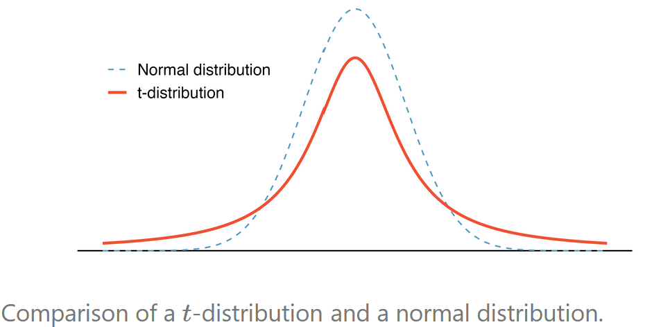
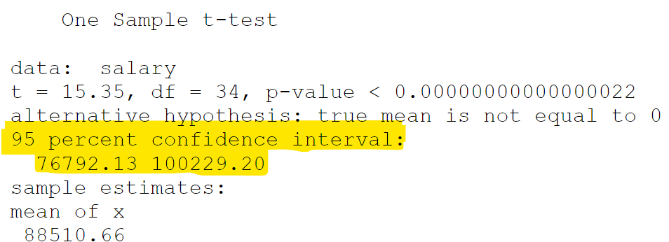

class: title-slide

```{r echo = FALSE, message=FALSE, warning = FALSE}
library(tidyverse)
library(janitor)
library(broom)
options(scipen=999)


```


<br>
<br>
.pull-right[ 

# `r rmarkdown::metadata$title`
## `r rmarkdown::metadata$author`
]

---

## Data

```{r echo=FALSE, message=FALSE}
lapd <- read_csv("Police_Payroll.csv")
```


```{r message = FALSE, warning = FALSE}
lapd <- lapd |> 
  clean_names() |> 
  filter(year == 2018) |> 
  select(base_pay, job_class_title, overtime_pay)
```


We will use payroll data from the LAPD from 2018.


```{r echo = TRUE}
glimpse(lapd)   
```

---

## Population Distribution

.pull-left[

```{r eval = FALSE}
lapd |> 
  ggplot(aes(x = base_pay)) +
  geom_histogram(binwidth = 10000) +
  theme_bw()
```

]

.pull-right[

```{r echo=FALSE}
lapd |> 
  ggplot(aes(x = base_pay)) +
  geom_histogram(binwidth = 10000) +
  theme_bw()
```
]

---

## Population Parameters

```{r}
x <- lapd$base_pay
n <- nrow(lapd)
```

Population mean:
```{r}
mean(x)
```

---

## Population Parameters

Population standard deviation: 

$\sigma = \sqrt{\sigma^{2}} = \sqrt{\frac{\Sigma_{i = 1}^{n} (x_i - \mu )^2}{N}}$

where $\mu$ is the mean of the population.

```{r}
sqrt(sum((x-mean(x))^2)/n)
```

or 

```{r eval = FALSE}
sqrt(var(x)*(n-1)/n)
```


---

## Statistical Inference

In real life, we often do not know population parameters but we can **estimate** them using a **statistic**, a numerical summary of a sample. 

- The sample mean $\bar{x}$ is used to estimate the population mean $\mu$.
- The sample standard deviation *s* is used to estimate the population standard deviation $\sigma$.
- The sample proportion *p* is used to estimate the population proportion $\pi$.

---

## Statistical Inference

We can use a sample statistic to create what is called a **confidence interval**, which is a range of plausible values that may capture the true population value.

- The method used to construct an interval is determine by various factors, including population and sample assumptions, sample size, method of sampling, among others. 

But one aspect that is true is that the variability of the data plays a roll in any type of interval constructed. 

---

### Sampling Variability

When using a statistic to estimate a parameter, we need to first understand the accuracy and reliability of our estimation; that is, how well the sample statistic reflects the population.

To do so, we can look at **how a statistic varies** around the parameter when many different statistics are calculated from many different samples. 

- When the variability across the samples is large, we expect the interval estimate to be wide and hence less accurate.
- When the variability across the samples is small, we expect the interval estimate to be narrow and hence more accurate.


---

## Taking Random Samples

Use the function `slice_sample(dataset, n = #)` to take a random sample of size `n` rows from our `dataset`. 

- This function generates a tibble with the randomly selected rows and keeps all variables of the data. 


We can also use the base R function `sample(data$variable, n, replace = TRUE/FALSE)`. 

- This function takes a vector of values and returns a vector with the randomly selected values. 


The function `set.seed(seed#)` will be used so that you will generate the same sample as the instructor for checking work and grading purposes. The seed # will always be given.

---

### Sample 1


```{r}
set.seed(12345)
sample_1 <- slice_sample(lapd, n = 10)
sample_1
```

---

### Sample 1

```{r}
mean(sample_1$base_pay)
```

Mean of sample 1 is

$\bar{x}_1=$ `r as.double(mean(sample_1$base_pay))`.


---

### Sample 2

```{r}
sample_2 <- slice_sample(lapd, n = 10)
sample_2
```

---
### Sample 2

```{r}
mean(sample_2$base_pay)
```

Mean of sample 2 is 

$\bar{x}_2=$ `r as.double(mean(sample_2$base_pay))`.


---

### Sample 3

```{r}
sample_3 <- slice_sample(lapd, n = 10)
sample_3
```

---
### Sample 3

```{r}
mean(sample_3$base_pay)
```

Mean of sample 3 is 

$\bar{x}_3=$ `r as.double(mean(sample_3$base_pay))`.

---

## Sampling Variability

Note that the mean **varies** from sample to sample. Each sample's mean is not necessarily the population mean we are trying to estimate. There is variance in the sample means.

 - **Sampling Distribution:** how a sample statistic is distributed when repeated trials of size n are taken.
 

---

class: inverse middle

.font75[Confidence Intervals Using the Sampling Distribution of the Sample Mean]

---

##Generating a Sampling Distribution

To generate the sampling distribution of the sample mean, we will retake 1000 samples, without replacement, from our population of values from the base pay. 

We will then calculate the mean for each of the 1000 samples and create a histogram to look at their overall pattern. 

---

### Generating a Sampling Distribution n = 5

- 1,000 samples
- size *n* = 5 

```{r echo = FALSE, eval = FALSE}
xbars <- 
  map_dfr(1:1000,
    ~ lapd |>
      slice_sample(n = 10) |>
      summarize(xbar = mean(base_pay))
  )

xbars
```


```{r }
xbars_5 <- numeric(1000)
for (i in 1:1000)
{
  xbars_5[i] <-  
    mean(sample(lapd$base_pay, 5, replace = FALSE))
}

xbars_5


```

---

### Sampling Distribution n = 5

.pull-left[
- 1,000 samples
- size *n* = 5 

```{r eval = FALSE }
hist(xbars_5)

```

```{r}
mean(xbars_5)
sqrt(var(xbars_5)*(999)/1000)
```
]

.pull-right[
```{r echo = FALSE}
hist(xbars_5)
```
]


```{r echo = FALSE, eval = FALSE}
x <- lapd$base_pay
N <- nrow(lapd)
n <- 5
mean(xbars_5)
sd(xbars_5)
sigxbar <- sqrt(var(xbars_5)*(999)/1000)
sigxbar
sigx <- sqrt(var(x)*(N-1)/N)
sigx
sigxbar2 <- sigx/sqrt(n)
sigxbar2
```


---


### Generating a Sampling Distribution n = 30

- 1,000 samples
- size *n* = 30

```{r }
xbars_30 <- numeric(1000)
for (i in 1:1000)
{
  xbars_30[i] <-  
    mean(sample(lapd$base_pay, 30, replace = FALSE))
}

```

---

### Sampling Distribution n = 30

.pull-left[
- 1,000 samples
- size *n* = 30

```{r eval = FALSE }
hist(xbars_30)

```

```{r}
mean(xbars_30)
sqrt(var(xbars_30)*(999)/1000)
```
]

.pull-right[
```{r echo = FALSE}
hist(xbars_30)
```
]


---


### Generating a Sampling Distribution n = 50

- 1,000 samples
- size *n* = 50

```{r }
xbars_50 <- numeric(1000)
for (i in 1:1000)
{
  xbars_50[i] <-  
    mean(sample(lapd$base_pay, 50, replace = FALSE))
}

```

---

### Sampling Distribution n = 50

.pull-left[
- 1,000 samples
- size *n* = 50

```{r eval = FALSE }
hist(xbars_50)

```

```{r}
mean(xbars_50)
sqrt(var(xbars_50)*(999)/1000)
```
]

.pull-right[
```{r echo = FALSE}
hist(xbars_50)
```
]

---

### Results from iterations

*n* = 5

mean = `r round(mean(xbars_5))` and sd = `r round(sqrt(var(xbars_5)*(999)/1000))`

*n* = 30

mean = `r round(mean(xbars_30))` and sd = `r round(sqrt(var(xbars_30)*(999)/1000))`

*n* = 50

mean = `r round(mean(xbars_50))` and sd = `r round(sqrt(var(xbars_50)*(999)/1000))`


---

### Results from iterations

How do our means compare to the population mean of `r round(mean(lapd$base_pay))` and population standard deviation of `r round(sqrt(var(x)*(n-1)/n))`?

--

 - mean of sample means is similar to population mean
 - standard deviation of sample means is smaller than population standard deviation. 

--

How about the shape of the distribution of the sample means?

--

 - symmetric bell shape

---


### Results from iterations

**Main Observations:**

 - No matter the sample size, n, the mean of the sample means is the same as the population mean. 
 
 - As the sample size, n, increases, the standard deviation of the sampling distribution of the sample means gets smaller. 

 - As the sample size, n, increases, the shape of the sampling distribution of the sample mean gets more bell shaped. 


---

### In rear life

Generating many samples of the same size helped us understand how the sampling distribution behaved. 

- However, in real life, taking many samples from the population is costly. We often only have one sample that we can use to estimate the population parameter.

--

- How can we take sampling variability into account when we only have one sample?

---

Under certain conditions, the variability of the sample mean is well described by the mathematical theory given by the Central Limit Theorem.

### Central Limit Theorem (CTL)

Suppose you have a random variable, *x*, that has a population mean, μ, and a population standard deviation, σ. If an independent sample of size *n* is taken, then the sampling distribution of the sample mean, $\bar{x}$ , becomes normally distributed (bell shaped) as n increases, with

- mean: $\mu_{\bar{x}} = \mu$
- standard deviation: $\sigma_{\bar{x} }=\frac{\sigma}{\sqrt{n}}$ (known as standard error)

---


Recall that the goal is to understand the distribution of $\bar{x}$ to determine how we can use it to estimate the population mean $\mu$. 

So if we do not know $\mu$ then, in practice, we cannot directly calculate the standard error for $\bar{x}$ since we do not know the population standard deviation, σ either. 

Our solution is to use the sample standard deviation, *s*, in place of $\sigma$ to approximate the standard error. 

standard error (SE) = $\frac{\sigma}{\sqrt{n}} \approx \frac{s}{\sqrt{n}}$

However, this brings in more variability since *s* also varies from sample to sample, and so the sampling distribution is no longer normal, per CLT.

When σ is unknown and it is estimated from the sample standard deviation s, the sampling distribution for the sample mean is a **Student’s t distribution.**

---

### Student's t Distribution 

.pull-left[Suppose an independent sample of size *n* is taken form a population that is normally distributed. Then the statistic 

$t = \frac{\bar{x}-\mu}{\frac{s}{\sqrt{n}}}$

follows a
student's t distribution with *n-1* degrees of freedom. 
]

.pull-right[
```{r fig.align='center', echo=FALSE, out.width="90%"}

```

The t-distribution is also bell shaped, but its tails are thicker than the normal distribution’s, and its bell curve fluctuates depending on the sample size. 
]

.footnote[Image from Intro to Modern Statistics OER textbook]

---

## Constructing a Confidence Interval for the Population Mean $\mu$ with unknown $\sigma$

**Requirements: **

 1. Independent sample or sample size is 5% or less of the population size, *n ≤ 0.05N*.
 2. Sample is obtained from a population that is normally distributed OR the sample size *n ≥ 30*.  
 
**Confidence Interval:** 

Suppose a random sample is obtained from a population with unknown $\mu$ and unknown $\sigma$, then the CL% confidence interval for $\mu$ is 

$\bar{x}\pm t^{\ast}\frac{s}{\sqrt{n}}$

where $\bar{x}$ is the sample mean, *s* is the sample mean, and $t^{\ast}$ is a multiplier based on the confidence level.  

---

## Constructing a Confidence Interval for the Population Mean $\mu$ using R

In this class, instead of using the formula, we will use the function `t.test(variable, conf.int = CL)` to help us find the interval for a population mean. 

- The first argument is a variable vector.
- CL is the confidence level in decimal form. 

---

### 95% Confidence Interval Example

Suppose we had the following SRS of n = 35 from the 2018 LAPD salaries, and that we wanted to find the 95% confidence interval for the average salary of all employees at the LAPD in 2018.

```{r}
salary <- sample(lapd$base_pay, 35, replace = FALSE)
salary
```
 
---

#### Verifying requirements:

  - random sample
  - $n = 35 > 30$
  - $35 \le 0.05(14,824)$ is true (independent sample)
  
```{r}
mean(salary)
```

The sample mean based on the sample of 35 employees is $\bar{x}=$ `r round(mean(salary))`. 

---

#### Using `t.test()` function to find the interval:

```{r}
t.test(salary, conf.level = .95)
```

```{r eval = FALSE, echo = FALSE}
tidy(t.test(salary, conf.level = .95))
```


---

```{r fig.align='center', echo=FALSE, out.width="90%"}

```


Lower bound = 76792 and upper bound = 100229

---

## Interpretation of Confidence Intervals

**Warning**: Calculating a confidence interval does not guarantee that we will capture the true value of a population parameter in the interval. 

--

If we were to take considerable large number of samples (we only had one sample) and construct 95% confidence intervals for each of the samples we would expect about 95% of the confidence intervals to capture the true value of the population parameter in the interval.

--

**Interpretation**: We are 95% confident that the true population mean of base pay salary for LAPD employees in 2018 is between $76,792 and $100,229.

--

- This confidence interval captures the true mean of `r round(mean(lapd$base_pay))`.

Note: Commonly used confidence levels in practice are 90%, 95%, and 99%.


---

However, what if we wanted to construct an interval for the median or the standard deviation, or the mean and we did not have access to the population or did not know assumptions are satisfied to use their mathematical model.  

**Bootstrapping** is a method for capturing the variability of any statistic when the mathematical model is unknown.

 - The bootstrap is a statistical method that allows us to approximate the sampling distribution even without access to the population.


