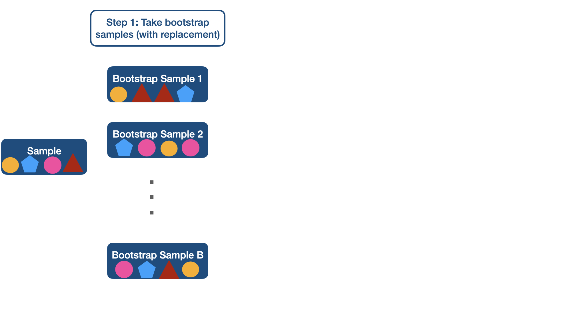
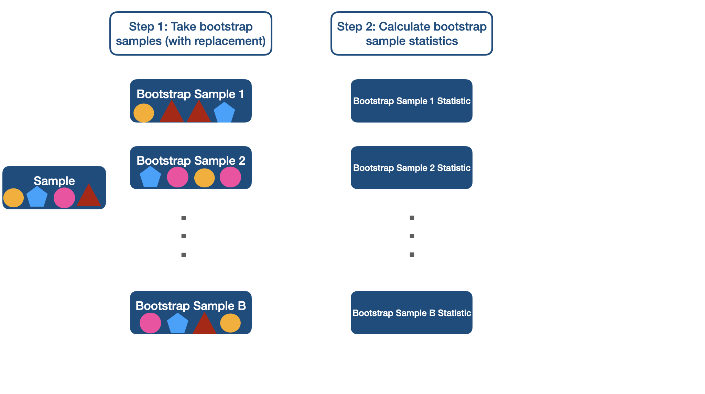
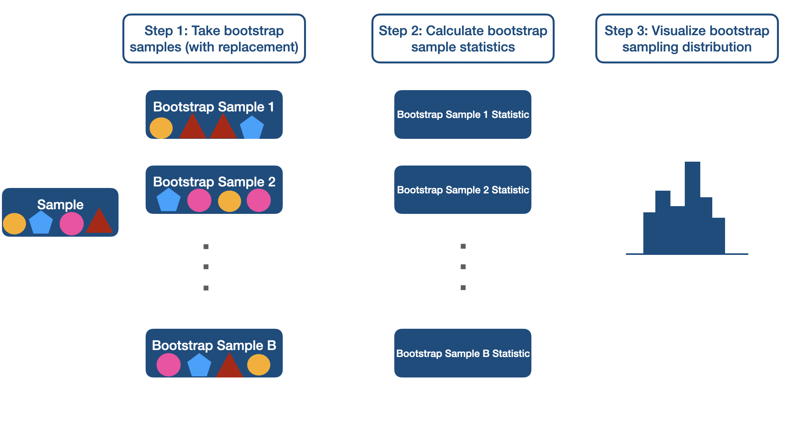

class: title-slide

```{r echo = FALSE, message=FALSE, warning = FALSE}
library(tidyverse)
library(janitor)
library(infer) # for bootstrap related functions
options(scipen=999) # to avoid scientific notation

```


<br>
<br>
.pull-right[ 

# `r rmarkdown::metadata$title`
## `r rmarkdown::metadata$author`
]

---

## Data

```{r message = FALSE, warning = FALSE}
lapd <- read_csv("Police_Payroll.csv") |> 
  clean_names() |> 
  filter(year == 2018) |> 
  select(base_pay, job_class_title, overtime_pay)
```


We will use payroll data from the LAPD from 2018.


```{r echo = TRUE}
glimpse(lapd)   
```

---

## Population Distribution


```{r echo=FALSE,fig.align='center'}
lapd |> 
  ggplot(aes(x = base_pay)) +
  geom_histogram(binwidth = 10000) +
  theme_bw()
```

---

## Sampling Variability

In the previous examples, we had access to the population data and so we could find the sampling distribution by repeatedly sampling from the population. Or we had satisfied certain assumptions from the population or sample that allowed us to use a mathematical model, such as the CLT. 

However, in real life, taking many samples from the population is costly. We often only have one sample that we can use to estimate the population parameter and we do not know much about the population.  

---

class: inverse middle

.pull-left[

<br>

.font75[Bootstrapping]

]

.pull-right[
```{r fig.align='center', echo=FALSE, out.width="50%"}

```
]

---
## Bootstrap

The **bootstrap** is a statistical method that allows us to approximate the sampling distribution even without access to the population.

 - Help us model how a statistic varies from one sample to another taken from the population.
 - Instead of taking many samples from the population, we will take many new samples from our original sample. This process is called **resampling**.
 - When sampling from a population, the sampling is done without replacement. When resampling, however, we do allow such duplication (in fact, this is what allows us to estimate the variability of the sample). Therefore, we sample with replacement.
 - For moderate to large sample sizes and sufficient number of bootstraps it has been proven that the bootstrap distribution approximates the sampling distribution. 

---

```{r fig.align='center', echo=FALSE, out.width="100%"}

```

---

```{r fig.align='center', echo=FALSE, out.width="100%"}

```

---

```{r fig.align='center', echo=FALSE, out.width="100%"}

```

---


```{r fig.align='center', echo=FALSE, out.width="100%"}

```

---

Let's say we wanted to estimate the population mean. 

If we have access to the population, we can simply compute it.

```{r}
mean(lapd$base_pay)
```

This is a **population parameter**, a numerical summary of a population. 

But what if we only had access to a sample and we wanted to estimate the true mean? 


---

## Taking random samples for bootstrap

When using bootstrap method, we use the function `sample_n(dataset, n)` to take a random sample of size `n` from our `dataset`. Recall that this generates a tibble with the randomly selected values (rows).  

- Again, `set.seed(seed #)` will be used so that you will generate the same sample as the instructor for checking work and grading purposes. The seed # will always be given. 

---

### Random Sample ($n$ = 30)

Using a seed of 12345, we will take a random sample of size n = 30 from the `lapd` dataset. 

```{r}
set.seed(12345)
lapd_sample <- sample_n(lapd, 30)
lapd_sample$base_pay

```

---

## Bootstrap Samples

We will retake 1000 samples, with replacement, from our sample of size n = 30 from base pay, and then calculate the mean for each of the 1000 samples.  

```{r}
boot <- lapd_sample |> 
  specify(response = base_pay) |> ## pulls the variable of interest 
  generate(reps = 1000, type = "bootstrap") |> ## generated 1000 samples of size 30
  calculate(stat = "mean") ##computes the mean for each of the 1000 samples
```

 - The function `specify()` is used to specify which columns in the supplied data set are the relevant response (and, if applicable, explanatory) variables. 
 - The function `generate()` creates a simulated distribution by re-sampling based on the type of samples specified.
 - The function `calculate()` will calculate the specified statistic for each replicate sample from `generate()`.
 
 

```{r eval = FALSE, echo = FALSE}
# alternative code to generate bootstrap samples using sample() function

set.seed(12345)
xbar_sample <- sample(lapd$base_pay, 30, replace = FALSE)

xbars_30 <- numeric(1000)
for (i in 1:1000)
{
  xbars_30[i] <-  mean(sample(xbar_sample, 30, replace = TRUE))
}

hist(xbars_30)
```
 
---

## Bootstrap Distribution

.pull-left[
To create a quick histogram of the bootstrap sample means, we use the function `visualize()`. Note that you can add a theme, color, and labels as desired. 

```{r eval = FALSE}
visualize(boot) +
  theme_bw()
```

]

.pull-right[
```{r echo = FALSE, out.width="90%"}
visualize(boot, bins = 15) +
  theme_bw() +
  theme(text = element_text(size = 20)) 
```
]

---

### Bootstrap Distribution vs Sampling Distribution


.pull-right[
```{r echo = FALSE}
xbars_30 <- numeric(1000)
for (i in 1:1000)
{
  xbars_30[i] <-  mean(sample(lapd$base_pay, 30, replace = FALSE))
}
```

```{r echo = FALSE, out.width = "99%"}
hist(xbars_30, main = "Sampling Distribution", ylim = c(0,300))
```
]

.pull-left[
```{r echo = FALSE, out.width="90%"}
visualize(boot, bin = 10) +
  theme_classic() +
  theme(text = element_text(size = 20)) 
```
]

```{r eval = FALSE, echo = FALSE}
ggplot (boot, 
        aes(x = stat)) +
  geom_histogram(binwidth = 5000)

hist(boot$stat)
```

---

## 95% Bootstrap Confidence Interval

We can construct the 95% confidence interval by calculating the 2.5th and 97.5th percentiles of the bootstrap distribution.

```{r}
boot |> 
  summarize(lower_bound = quantile(stat, 0.025),
            upper_bound = quantile(stat, 0.975))
```

---


## Interpretation of Confidence Intervals

**Warning**: Calculating a confidence interval does not guarantee that we will capture the true value of population parameter in the interval. 


**Interpretation**: We are 95% confident that the true mean base pay salary for LAPD employees in 2018 is between $69,279 and $96,887.

--

- This confidence interval captures the true mean ($85,149).


---

Commonly used confidence levels in practice are 90% (blue), 95% (red), and 99% (black).


```{r echo = FALSE}
ci <-
  boot |> 
  summarize(lower_bound = quantile(stat, 0.025),
            upper_bound = quantile(stat, 0.975))

lower_95 <- 
  boot |> 
  summarize(lower_bound = quantile(stat, 0.025)) |>
  pull()
upper_95 <- 
  boot |> 
  summarize(upper_bound = quantile(stat, 0.975)) |>
  pull()

lower_90 <- 
  boot |> 
  summarize(lower_bound = quantile(stat, 0.05)) |>
  pull()

upper_90 <- 
  boot |> 
  summarize(upper_bound = quantile(stat, 0.95)) |>
  pull()

lower_99 <- 
  boot |> 
  summarize(lower_bound = quantile(stat, 0.005)) |>
  pull()

upper_99 <- 
  boot |> 
  summarize(upper_bound = quantile(stat, 0.995)) |>
  pull()

```


```{r echo=FALSE, fig.align='center'}
visualize(boot) +
  geom_vline(xintercept = c(lower_95,
                            upper_95), 
             color = "red") +
   geom_vline(xintercept = c(lower_90,
                            upper_90), 
             color = "blue") +
   geom_vline(xintercept = c(lower_99,
                            upper_99), 
             color = "green")
```

---

## Take-Away Messages

- Sample statistics $\neq$ population parameter.

--

- Different samples can have different statistics, thus there is sampling variability.

--

- We have constructed a confidence interval to infer about a mean but we could do this for median, proportion, standard deviation, difference between two group means etc. 

--

- More on constructing confidence intervals (and hypothesis testing) in other statistics classes. In this class, we will focus on using and interpreting confidence intervals. R will do the calculations for us. 


